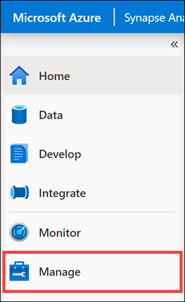
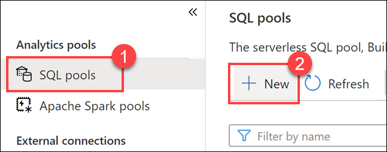
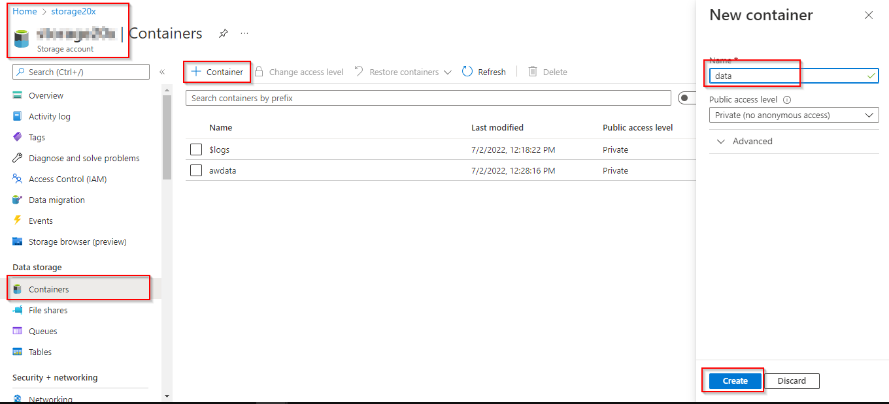
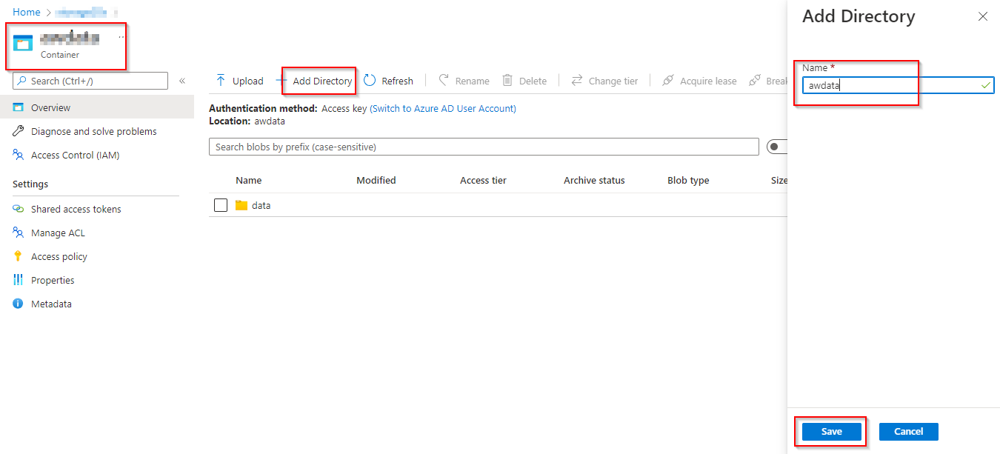
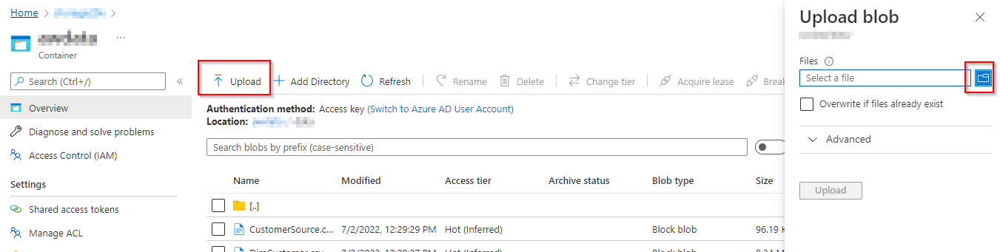
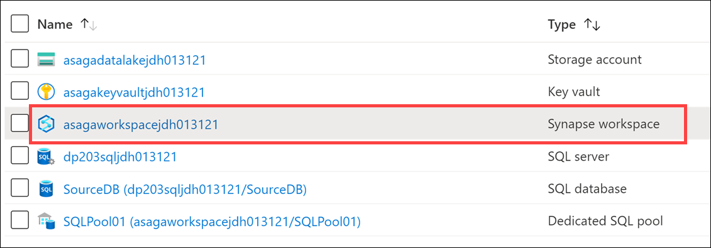
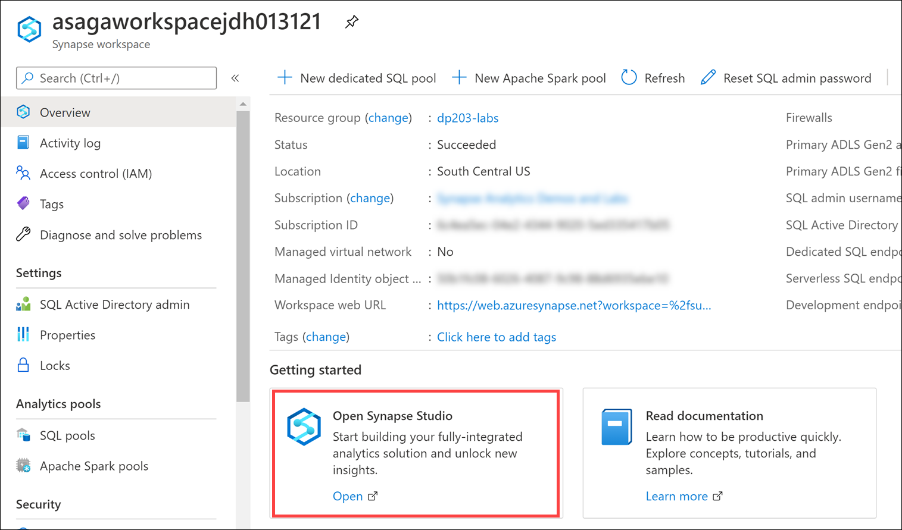
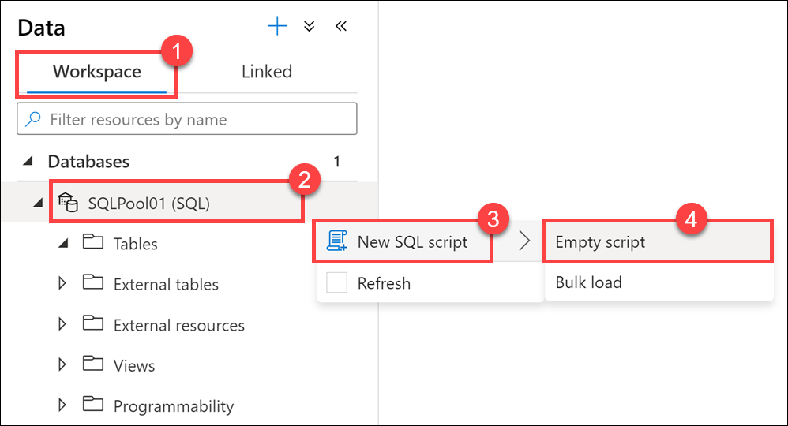
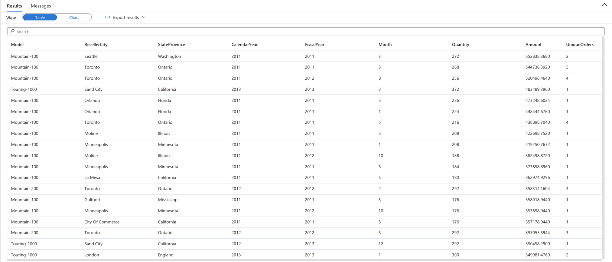
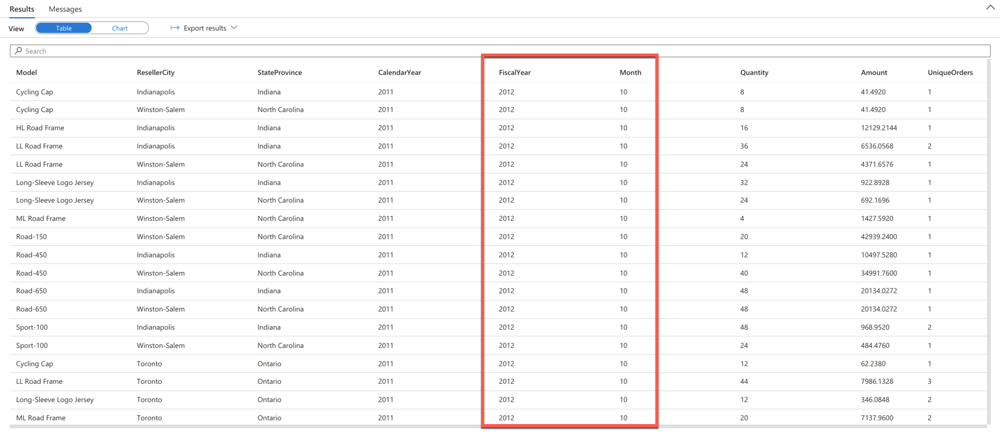

# Module 01 - Design and Implement the serving layer

### Lab setup and pre-requisites
Before starting this lab, ensure you have successfully completed the setup steps to create your lab environment. 

Then complete the following setup tasks to create a dedicated SQL pool.

> **Note**: The setup tasks will take around 6-7 minutes. You can continue the lab while the script runs.

### Task 1: Create dedicated SQL pool

1. Open Synapse Studio (<https://web.azuresynapse.net/>).

2. Select the **Manage** hub.

    

3. Select **SQL pools** in the left-hand menu, then select **+ New**.

    

4. In the **Create dedicated SQL pool** page, enter **`SQLPool01`** (You <u>must</u> use this name exactly as displayed here) for the pool name, and then set the performance level to **DW100c** (move the slider all the way to the left).

5. Click **Review + create**. Then select **Create** on the validation step.
6. Wait until the dedicated SQL pool is created.

> **Important:** Once started, a dedicated SQL pool consumes credits in your Azure subscription until it is paused. If you take a break from this lab, or decide not to complete it; follow the instructions at the end of the lab to **pause your SQL pool**

### Task 2: Upload CSV file to Data Lake Storage account

1. 
2. 
3. 
4. Click on upload

## Exercise 1: Implementing a Star Schema

Star schema is a mature modeling approach widely adopted by relational data warehouses. It requires modelers to classify their model tables as either dimension or fact.

**Dimension tables** describe business entities—the things you model. Entities can include products, people, places, and concepts including time itself. The most consistent table you'll find in a star schema is a date dimension table. A dimension table contains a key column (or columns) that acts as a unique identifier, and descriptive columns.

Dimension tables contain attribute data that might change but usually changes infrequently. For example, a customer's name and address are stored in a dimension table and updated only when the customer's profile changes. To minimize the size of a large fact table, the customer's name and address don't need to be in every row of a fact table. Instead, the fact table and the dimension table can share a customer ID. A query can join the two tables to associate a customer's profile and transactions.

**Fact tables** store observations or events, and can be sales orders, stock balances, exchange rates, temperatures, etc. A fact table contains dimension key columns that relate to dimension tables, and numeric measure columns. The dimension key columns determine the dimensionality of a fact table, while the dimension key values determine the granularity of a fact table. For example, consider a fact table designed to store sale targets that has two dimension key columns `Date` and `ProductKey`. It's easy to understand that the table has two dimensions. The granularity, however, can't be determined without considering the dimension key values. In this example, consider that the values stored in the Date column are the first day of each month. In this case, the granularity is at month-product level.

Generally, dimension tables contain a relatively small number of rows. Fact tables, on the other hand, can contain a very large number of rows and continue to grow over time.

For larger data sets you may implement your data warehouse in Azure Synapse instead of SQL Server. Star schema models are still a best practice for modeling data in Synapse dedicated SQL pools. You may notice some differences with creating tables in Synapse Analytics vs. SQL database, but the same data modeling principles apply.

When you create a star schema or snowflake schema in Synapse, it requires some changes to your table creation scripts. In Synapse, you do not have foreign keys and unique value constraints like you do in SQL Server. Since these rules are not enforced at the database layer, the jobs used to load data are more responsible to maintain data integrity. You still have the option to use clustered indexes, but for most dimension tables in Synapse you will benefit from using a clustered columnstore index (CCI).

Since Synapse Analytics is a [massively parallel processing](https://docs.microsoft.com/azure/architecture/data-guide/relational-data/data-warehousing#data-warehousing-in-azure) (MPP) system, you must consider how data is distributed in your table design, as opposed to symmetric multiprocessing (SMP) systems, such as OLTP databases like Azure SQL Database. The table category often determines which option to choose for distributing the table.

| Table category | Recommended distribution option |
|:---------------|:--------------------|
| Fact           | Use hash-distribution with clustered columnstore index. Performance improves when two hash tables are joined on the same distribution column. |
| Dimension      | Use replicated for smaller tables. If tables are too large to store on each Compute node, use hash-distributed. |
| Staging        | Use round-robin for the staging table. The load with CTAS is fast. Once the data is in the staging table, use INSERT...SELECT to move the data to production tables. |

In the case of the dimension tables in this exercise, the amount of data stored per table falls well within the criteria for using a replicated distribution.

### Task 1: Create star schema in Synapse dedicated SQL

In this task, you create a star schema in Azure Synapse dedicated pool. The first step is to create the base dimension and fact tables.

1. Sign in to the Azure portal (<https://portal.azure.com>).

2. Open the resource group for this lab, then select the **Synapse workspace**.

    

3. In your Synapse workspace Overview blade, select the **Open** link within `Open Synapse Studio`.

    

4. In Synapse Studio, navigate to the **Data** hub.

    

5. Select the **Workspace** tab **(1)**, expand Databases, then right-click on **SQLPool01 (2)**. Select **New SQL script (3)**, then select **Empty script (4)**.

    

6. Paste the following script into the empty script window, then select **Run** or hit `F5` to execute the query. You may notice some changes have been made to the original SQL star schema create script. A few notable changes are:
    - Distribution setting has been added to each table
    - Clustered columnstore index is used for most tables.
    - HASH function is used for Fact table distribution since it will be a larger table that should be distributed across nodes.
    - A few fields are using varbinary data types that cannot be included in a clustered columnstore index in Azure Synapse. As a simple solution, a clustered index was used instead.
    
    ```sql
    CREATE TABLE dbo.[DimCustomer](
        [CustomerID] [int] NOT NULL,
        [Title] [nvarchar](8) NULL,
        [FirstName] [nvarchar](50) NOT NULL,
        [MiddleName] [nvarchar](50) NULL,
        [LastName] [nvarchar](50) NOT NULL,
        [Suffix] [nvarchar](10) NULL,
        [CompanyName] [nvarchar](128) NULL,
        [SalesPerson] [nvarchar](256) NULL,
        [EmailAddress] [nvarchar](50) NULL,
        [Phone] [nvarchar](25) NULL,
        [InsertedDate] [datetime] NOT NULL,
        [ModifiedDate] [datetime] NOT NULL,
        [HashKey] [char](66)
    )
    WITH
    (
        DISTRIBUTION = REPLICATE,
        CLUSTERED COLUMNSTORE INDEX
    );
    GO
    
    CREATE TABLE [dbo].[FactResellerSales](
        [ProductKey] [int] NOT NULL,
        [OrderDateKey] [int] NOT NULL,
        [DueDateKey] [int] NOT NULL,
        [ShipDateKey] [int] NOT NULL,
        [ResellerKey] [int] NOT NULL,
        [EmployeeKey] [int] NOT NULL,
        [PromotionKey] [int] NOT NULL,
        [CurrencyKey] [int] NOT NULL,
        [SalesTerritoryKey] [int] NOT NULL,
        [SalesOrderNumber] [nvarchar](20) NOT NULL,
        [SalesOrderLineNumber] [tinyint] NOT NULL,
        [RevisionNumber] [tinyint] NULL,
        [OrderQuantity] [smallint] NULL,
        [UnitPrice] [money] NULL,
        [ExtendedAmount] [money] NULL,
        [UnitPriceDiscountPct] [float] NULL,
        [DiscountAmount] [float] NULL,
        [ProductStandardCost] [money] NULL,
        [TotalProductCost] [money] NULL,
        [SalesAmount] [money] NULL,
        [TaxAmt] [money] NULL,
        [Freight] [money] NULL,
        [CarrierTrackingNumber] [nvarchar](25) NULL,
        [CustomerPONumber] [nvarchar](25) NULL,
        [OrderDate] [datetime] NULL,
        [DueDate] [datetime] NULL,
        [ShipDate] [datetime] NULL
    )
    WITH
    (
        DISTRIBUTION = HASH([SalesOrderNumber]),
        CLUSTERED COLUMNSTORE INDEX
    );
    GO

    CREATE TABLE [dbo].[DimDate]
    ( 
        [DateKey] [int]  NOT NULL,
        [DateAltKey] [datetime]  NOT NULL,
        [CalendarYear] [int]  NOT NULL,
        [CalendarQuarter] [int]  NOT NULL,
        [MonthOfYear] [int]  NOT NULL,
        [MonthName] [nvarchar](15)  NOT NULL,
        [DayOfMonth] [int]  NOT NULL,
        [DayOfWeek] [int]  NOT NULL,
        [DayName] [nvarchar](15)  NOT NULL,
        [FiscalYear] [int]  NOT NULL,
        [FiscalQuarter] [int]  NOT NULL
    )
    WITH
    (
        DISTRIBUTION = REPLICATE,
        CLUSTERED COLUMNSTORE INDEX
    );
    GO

    CREATE TABLE [dbo].[DimReseller](
        [ResellerKey] [int] NOT NULL,
        [GeographyKey] [int] NULL,
        [ResellerAlternateKey] [nvarchar](15) NULL,
        [Phone] [nvarchar](25) NULL,
        [BusinessType] [varchar](20) NOT NULL,
        [ResellerName] [nvarchar](50) NOT NULL,
        [NumberEmployees] [int] NULL,
        [OrderFrequency] [char](1) NULL,
        [OrderMonth] [tinyint] NULL,
        [FirstOrderYear] [int] NULL,
        [LastOrderYear] [int] NULL,
        [ProductLine] [nvarchar](50) NULL,
        [AddressLine1] [nvarchar](60) NULL,
        [AddressLine2] [nvarchar](60) NULL,
        [AnnualSales] [money] NULL,
        [BankName] [nvarchar](50) NULL,
        [MinPaymentType] [tinyint] NULL,
        [MinPaymentAmount] [money] NULL,
        [AnnualRevenue] [money] NULL,
        [YearOpened] [int] NULL
    )
    WITH
    (
        DISTRIBUTION = REPLICATE,
        CLUSTERED COLUMNSTORE INDEX
    );
    GO
    
    CREATE TABLE [dbo].[DimEmployee](
        [EmployeeKey] [int] NOT NULL,
        [ParentEmployeeKey] [int] NULL,
        [EmployeeNationalIDAlternateKey] [nvarchar](15) NULL,
        [ParentEmployeeNationalIDAlternateKey] [nvarchar](15) NULL,
        [SalesTerritoryKey] [int] NULL,
        [FirstName] [nvarchar](50) NOT NULL,
        [LastName] [nvarchar](50) NOT NULL,
        [MiddleName] [nvarchar](50) NULL,
        [NameStyle] [bit] NOT NULL,
        [Title] [nvarchar](50) NULL,
        [HireDate] [date] NULL,
        [BirthDate] [date] NULL,
        [LoginID] [nvarchar](256) NULL,
        [EmailAddress] [nvarchar](50) NULL,
        [Phone] [nvarchar](25) NULL,
        [MaritalStatus] [nchar](1) NULL,
        [EmergencyContactName] [nvarchar](50) NULL,
        [EmergencyContactPhone] [nvarchar](25) NULL,
        [SalariedFlag] [bit] NULL,
        [Gender] [nchar](1) NULL,
        [PayFrequency] [tinyint] NULL,
        [BaseRate] [money] NULL,
        [VacationHours] [smallint] NULL,
        [SickLeaveHours] [smallint] NULL,
        [CurrentFlag] [bit] NOT NULL,
        [SalesPersonFlag] [bit] NOT NULL,
        [DepartmentName] [nvarchar](50) NULL,
        [StartDate] [date] NULL,
        [EndDate] [date] NULL,
        [Status] [nvarchar](50) NULL,
        [EmployeePhoto] [varbinary](max) NULL
    )
    WITH
    (
        DISTRIBUTION = REPLICATE,
        CLUSTERED INDEX (EmployeeKey)
    );
    GO
    
    CREATE TABLE [dbo].[DimProduct](
        [ProductKey] [int] NOT NULL,
        [ProductAlternateKey] [nvarchar](25) NULL,
        [ProductSubcategoryKey] [int] NULL,
        [WeightUnitMeasureCode] [nchar](3) NULL,
        [SizeUnitMeasureCode] [nchar](3) NULL,
        [EnglishProductName] [nvarchar](50) NOT NULL,
        [SpanishProductName] [nvarchar](50) NULL,
        [FrenchProductName] [nvarchar](50) NULL,
        [StandardCost] [money] NULL,
        [FinishedGoodsFlag] [bit] NOT NULL,
        [Color] [nvarchar](15) NOT NULL,
        [SafetyStockLevel] [smallint] NULL,
        [ReorderPoint] [smallint] NULL,
        [ListPrice] [money] NULL,
        [Size] [nvarchar](50) NULL,
        [SizeRange] [nvarchar](50) NULL,
        [Weight] [float] NULL,
        [DaysToManufacture] [int] NULL,
        [ProductLine] [nchar](2) NULL,
        [DealerPrice] [money] NULL,
        [Class] [nchar](2) NULL,
        [Style] [nchar](2) NULL,
        [ModelName] [nvarchar](50) NULL,
        [LargePhoto] [varbinary](max) NULL,
        [EnglishDescription] [nvarchar](400) NULL,
        [FrenchDescription] [nvarchar](400) NULL,
        [ChineseDescription] [nvarchar](400) NULL,
        [ArabicDescription] [nvarchar](400) NULL,
        [HebrewDescription] [nvarchar](400) NULL,
        [ThaiDescription] [nvarchar](400) NULL,
        [GermanDescription] [nvarchar](400) NULL,
        [JapaneseDescription] [nvarchar](400) NULL,
        [TurkishDescription] [nvarchar](400) NULL,
        [StartDate] [datetime] NULL,
        [EndDate] [datetime] NULL,
        [Status] [nvarchar](7) NULL    
    )
    WITH
    (
        DISTRIBUTION = REPLICATE,
        CLUSTERED INDEX (ProductKey)
    );
    GO

    CREATE TABLE [dbo].[DimGeography](
        [GeographyKey] [int] NOT NULL,
        [City] [nvarchar](30) NULL,
        [StateProvinceCode] [nvarchar](3) NULL,
        [StateProvinceName] [nvarchar](50) NULL,
        [CountryRegionCode] [nvarchar](3) NULL,
        [EnglishCountryRegionName] [nvarchar](50) NULL,
        [SpanishCountryRegionName] [nvarchar](50) NULL,
        [FrenchCountryRegionName] [nvarchar](50) NULL,
        [PostalCode] [nvarchar](15) NULL,
        [SalesTerritoryKey] [int] NULL,
        [IpAddressLocator] [nvarchar](15) NULL
    )
    WITH
    (
        DISTRIBUTION = REPLICATE,
        CLUSTERED COLUMNSTORE INDEX
    );
    GO
    ```
    You will find `Run` in the top left corner of the script window.

### Task 2: Load data into Synapse tables

In this task, you load the Synapse dimension and fact tables with data from a public data source. There are two ways to load this data from Azure Storage files using T-SQL: the COPY command or selecting from external tables using Polybase. For this task you will use COPY since it is a simple and flexible syntax for loading delimited data from Azure Storage. If the source were a private storage account you would include a CREDENTIAL option to authorize the COPY command to read the data, but for this example that is not required.

1. Paste **and execute** the query with the following to insert data into the fact and dimension tables:

    ```sql
    COPY INTO [dbo].[DimProduct]
    FROM 'https://solliancepublicdata.blob.core.windows.net/dataengineering/dp-203/awdata/DimProduct.csv'
    WITH (
        FILE_TYPE='CSV',
        FIELDTERMINATOR='|',
        FIELDQUOTE='',
        ROWTERMINATOR='\n',
        ENCODING = 'UTF16'
    );
    GO

    COPY INTO [dbo].[DimReseller]
    FROM 'https://solliancepublicdata.blob.core.windows.net/dataengineering/dp-203/awdata/DimReseller.csv'
    WITH (
        FILE_TYPE='CSV',
        FIELDTERMINATOR='|',
        FIELDQUOTE='',
        ROWTERMINATOR='\n',
        ENCODING = 'UTF16'
    );
    GO

    COPY INTO [dbo].[DimEmployee]
    FROM 'https://solliancepublicdata.blob.core.windows.net/dataengineering/dp-203/awdata/DimEmployee.csv'
    WITH (
        FILE_TYPE='CSV',
        FIELDTERMINATOR='|',
        FIELDQUOTE='',
        ROWTERMINATOR='\n',
        ENCODING = 'UTF16'
    );
    GO

    COPY INTO [dbo].[DimGeography]
    FROM 'https://solliancepublicdata.blob.core.windows.net/dataengineering/dp-203/awdata/DimGeography.csv'
    WITH (
        FILE_TYPE='CSV',
        FIELDTERMINATOR='|',
        FIELDQUOTE='',
        ROWTERMINATOR='\n',
        ENCODING = 'UTF16'
    );
    GO

    COPY INTO [dbo].[FactResellerSales]
    FROM 'https://solliancepublicdata.blob.core.windows.net/dataengineering/dp-203/awdata/FactResellerSales.csv'
    WITH (
        FILE_TYPE='CSV',
        FIELDTERMINATOR='|',
        FIELDQUOTE='',
        ROWTERMINATOR='\n',
        ENCODING = 'UTF16'
    );
    GO
    ```

2. To populate the time dimension table in Azure Synapse, it is fastest to load the data from a delimited file since the looping method used to create the time data runs slowly. To populate this important time dimension, paste **and execute** the following in the query window:

    ```sql
    COPY INTO [dbo].[DimDate]
    FROM 'https://solliancepublicdata.blob.core.windows.net/dataengineering/dp-203/awdata/DimDate.csv'
    WITH (
        FILE_TYPE='CSV',
        FIELDTERMINATOR='|',
        FIELDQUOTE='',
        ROWTERMINATOR='0x0a',
        ENCODING = 'UTF16'
    );
    GO
    ```

### Task 3: Query data from Synapse

1. Paste **and execute** the following query to retrieve reseller sales data from the Synapse star schema at the reseller location, product, and month granularity:

    ```sql
    SELECT
        Coalesce(p.[ModelName], p.[EnglishProductName]) AS [Model]
        ,g.City AS ResellerCity
        ,g.StateProvinceName AS StateProvince
        ,d.[CalendarYear]
        ,d.[FiscalYear]
        ,d.[MonthOfYear] AS [Month]
        ,sum(f.OrderQuantity) AS Quantity
        ,sum(f.ExtendedAmount) AS Amount
        ,approx_count_distinct(f.SalesOrderNumber) AS UniqueOrders  
    FROM
        [dbo].[FactResellerSales] f
    INNER JOIN [dbo].[DimReseller] r
        ON f.ResellerKey = r.ResellerKey
    INNER JOIN [dbo].[DimGeography] g
        ON r.GeographyKey = g.GeographyKey
    INNER JOIN [dbo].[DimDate] d
        ON f.[OrderDateKey] = d.[DateKey]
    INNER JOIN [dbo].[DimProduct] p
        ON f.[ProductKey] = p.[ProductKey]
    GROUP BY
        Coalesce(p.[ModelName], p.[EnglishProductName])
        ,g.City
        ,g.StateProvinceName
        ,d.[CalendarYear]
        ,d.[FiscalYear]
        ,d.[MonthOfYear]
    ORDER BY Amount DESC
    ```

    You should see an output similar to the following:

    

2. Replace **and execute** the query with the following to limit the results to October sales between the 2012 and 2013 fiscal years:

    ```sql
    SELECT
        Coalesce(p.[ModelName], p.[EnglishProductName]) AS [Model]
        ,g.City AS ResellerCity
        ,g.StateProvinceName AS StateProvince
        ,d.[CalendarYear]
        ,d.[FiscalYear]
        ,d.[MonthOfYear] AS [Month]
        ,sum(f.OrderQuantity) AS Quantity
        ,sum(f.ExtendedAmount) AS Amount
        ,approx_count_distinct(f.SalesOrderNumber) AS UniqueOrders  
    FROM
        [dbo].[FactResellerSales] f
    INNER JOIN [dbo].[DimReseller] r
        ON f.ResellerKey = r.ResellerKey
    INNER JOIN [dbo].[DimGeography] g
        ON r.GeographyKey = g.GeographyKey
    INNER JOIN [dbo].[DimDate] d
        ON f.[OrderDateKey] = d.[DateKey]
    INNER JOIN [dbo].[DimProduct] p
        ON f.[ProductKey] = p.[ProductKey]
    WHERE d.[MonthOfYear] = 10 AND d.[FiscalYear] IN (2012, 2013)
    GROUP BY
        Coalesce(p.[ModelName], p.[EnglishProductName])
        ,g.City
        ,g.StateProvinceName
        ,d.[CalendarYear]
        ,d.[FiscalYear]
        ,d.[MonthOfYear]
    ORDER BY d.[FiscalYear]
    ```

    You should see an output similar to the following:

    

    > Notice how using the **time dimension table** makes filtering by specific date parts and logical dates (such as fiscal year) easier and more performant than calculating date functions on the fly.
