# Module 01 - Design and Implement the serving layer

### Lab setup and pre-requisites
Before starting this lab, ensure you have successfully completed the setup steps to create your lab environment. 

Then complete the following setup tasks to create a dedicated SQL pool.

> **Note**: The setup tasks will take around 6-7 minutes. You can continue the lab while the script runs.

### Task 1: Create dedicated SQL pool

1. Open Synapse Studio (<https://web.azuresynapse.net/>).

2. Select the **Manage** hub.

    

3. Select **SQL pools** in the left-hand menu, then select **+ New**.

    

4. In the **Create dedicated SQL pool** page, enter **`SQLPool01`** (You <u>must</u> use this name exactly as displayed here) for the pool name, and then set the performance level to **DW100c** (move the slider all the way to the left).

5. Click **Review + create**. Then select **Create** on the validation step.
6. Wait until the dedicated SQL pool is created.

> **Important:** Once started, a dedicated SQL pool consumes credits in your Azure subscription until it is paused. If you take a break from this lab, or decide not to complete it; follow the instructions at the end of the lab to **pause your SQL pool**

### Task 2: Upload CSV file to Data Lake Storage account

1. Step 1

    

2. Step 2
    

3. Step 3
    

4. Download awdata file and upload to the awdata directory [Click here to download](https://github.com/pankajcloudthat/alchemy-imb/tree/main/data/awdata) and then Click on upload

### Task 3: Create and configure a SQL Database instance.

1. In the Azure portal, navigate to the **+ Create a resource** blade.

2. In the New screen, click the **Search services and marketplace** text box, and type the word **SQL Database**. Click **SQL Database** in the list that appears.

3. In the **SQL Database** screen, click **Create**.

4. From the **Create SQL Database** screen, create an Azure SQL Database with the following settings:

    - In the Project details section, type in the following information
    
        - **Subscription**: the name of the subscription you are using in this lab

        - **Resource group**: **awrgstudxx**, where **xx** are your initials.
        
        - **Cmpute + Storage**: Select Standard Service Tier
        
        Step 1:
        
        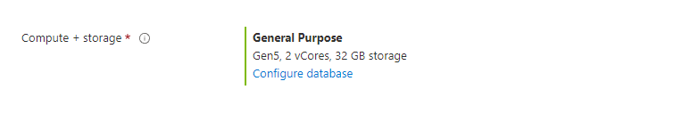
        
        Step 2:
        
        
        
        Step 3:
        
        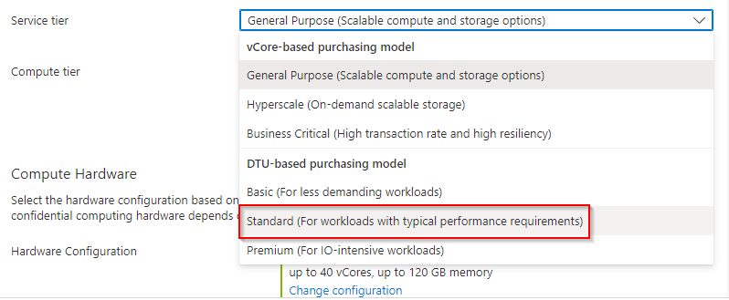
        
        Step 4:
        
        

    - Click on the  **Additional setting** tab, click **Sample** . The AdventureworksLT sample database is selected automatically. 
    
    - Click the **Basics** tab once this has been done.
    
    - In the Database details section, type in the following information
    
        - Database name: type in **AdventureworksLT**
     
        - Server: Create a new server by clicking **Create new** with the following settings and click on **OK**:
            - **Server name**: **sqlservicexx**, where **xx** are your initials
            - **Server admin login**: **xxsqladmin**, where **xx** are your initials
            - **Password**: **Pa55w.rd**
            - **Confirm Password**: **Pa55w.rd**
            - **Location**: choose a **location** near to you.
            - click on **OK**
            - Leave the remaining settings to their defaults, and then click on **OK**

5. In the **Create SQL Database** blade, click **Review + create**.

6. After the validation of the **Create SQL Database*** blade, click **Create**.

   > **Note**: The provision will takes approximately 4 minutes.

> **Result**: After you completed this exercise, you have an Azure SQL Database instance

## Exercise 1: Implementing a Star Schema

Star schema is a mature modeling approach widely adopted by relational data warehouses. It requires modelers to classify their model tables as either dimension or fact.

**Dimension tables** describe business entities—the things you model. Entities can include products, people, places, and concepts including time itself. The most consistent table you'll find in a star schema is a date dimension table. A dimension table contains a key column (or columns) that acts as a unique identifier, and descriptive columns.

Dimension tables contain attribute data that might change but usually changes infrequently. For example, a customer's name and address are stored in a dimension table and updated only when the customer's profile changes. To minimize the size of a large fact table, the customer's name and address don't need to be in every row of a fact table. Instead, the fact table and the dimension table can share a customer ID. A query can join the two tables to associate a customer's profile and transactions.

**Fact tables** store observations or events, and can be sales orders, stock balances, exchange rates, temperatures, etc. A fact table contains dimension key columns that relate to dimension tables, and numeric measure columns. The dimension key columns determine the dimensionality of a fact table, while the dimension key values determine the granularity of a fact table. For example, consider a fact table designed to store sale targets that has two dimension key columns `Date` and `ProductKey`. It's easy to understand that the table has two dimensions. The granularity, however, can't be determined without considering the dimension key values. In this example, consider that the values stored in the Date column are the first day of each month. In this case, the granularity is at month-product level.

Generally, dimension tables contain a relatively small number of rows. Fact tables, on the other hand, can contain a very large number of rows and continue to grow over time.

### Task 1: Create star schema in SQL database

In this task, you create a star schema in SQL database, using foreign key constraints. The first step is to create the base dimension and fact tables.

1. Sign in to the Azure portal (<https://portal.azure.com>).
2. Open the resource group for this lab, then select the **SQL Database**.
3. Copy the **Server name** value on the Overview pane.

    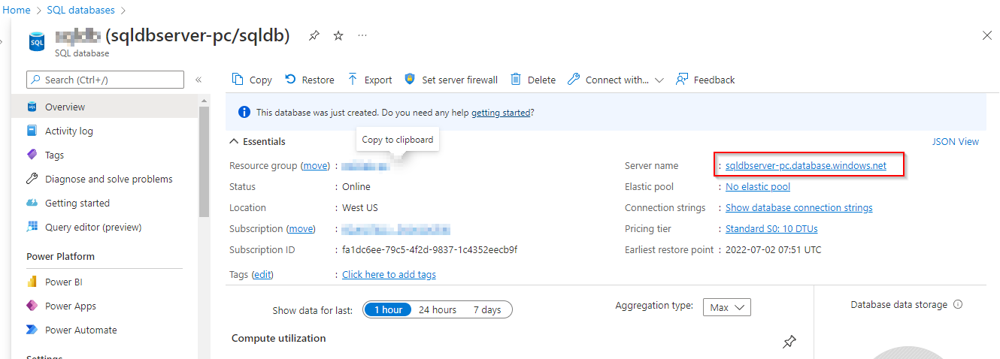

4. Open Azure Data Studio.

5. Select **Servers** on the left-hand menu, then click **Add Connection**.

    

6. In the Connection Details form, provide the following information:

    - **Server**: Paste the SourceDB server name value here.
    - **Authentication type**: Select `SQL Login`.
    - **User name**: Enter `sqladmin`.
    - **Password**: Enter the password you supplied when deploying the lab environment, or which was provided to you as part of your hosted lab environment.
    - **Remember password**: Checked.
    - **Database**: Select `SourceDB`.

    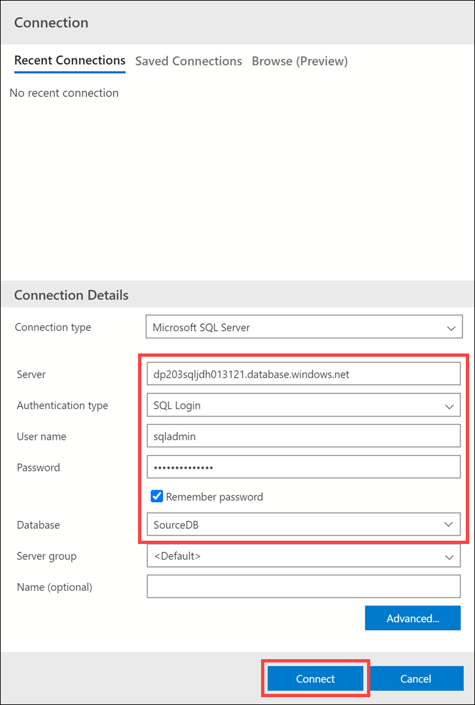

7. Select **Connect**.

8. Select **Servers** in the left-hand menu, then right-click the SQL server you added at the beginning of the lab. Select **New Query**.

    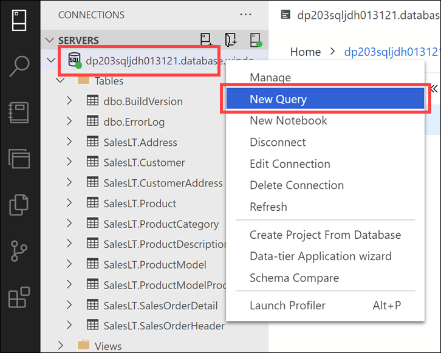

9. Paste the following into the query window to create the dimension and fact tables:

    ```sql
    CREATE TABLE [dbo].[DimReseller](
        [ResellerKey] [int] IDENTITY(1,1) NOT NULL,
        [GeographyKey] [int] NULL,
        [ResellerAlternateKey] [nvarchar](15) NULL,
        [Phone] [nvarchar](25) NULL,
        [BusinessType] [varchar](20) NOT NULL,
        [ResellerName] [nvarchar](50) NOT NULL,
        [NumberEmployees] [int] NULL,
        [OrderFrequency] [char](1) NULL,
        [OrderMonth] [tinyint] NULL,
        [FirstOrderYear] [int] NULL,
        [LastOrderYear] [int] NULL,
        [ProductLine] [nvarchar](50) NULL,
        [AddressLine1] [nvarchar](60) NULL,
        [AddressLine2] [nvarchar](60) NULL,
        [AnnualSales] [money] NULL,
        [BankName] [nvarchar](50) NULL,
        [MinPaymentType] [tinyint] NULL,
        [MinPaymentAmount] [money] NULL,
        [AnnualRevenue] [money] NULL,
        [YearOpened] [int] NULL
    );
    GO

    CREATE TABLE [dbo].[DimEmployee](
        [EmployeeKey] [int] IDENTITY(1,1) NOT NULL,
        [ParentEmployeeKey] [int] NULL,
        [EmployeeNationalIDAlternateKey] [nvarchar](15) NULL,
        [ParentEmployeeNationalIDAlternateKey] [nvarchar](15) NULL,
        [SalesTerritoryKey] [int] NULL,
        [FirstName] [nvarchar](50) NOT NULL,
        [LastName] [nvarchar](50) NOT NULL,
        [MiddleName] [nvarchar](50) NULL,
        [NameStyle] [bit] NOT NULL,
        [Title] [nvarchar](50) NULL,
        [HireDate] [date] NULL,
        [BirthDate] [date] NULL,
        [LoginID] [nvarchar](256) NULL,
        [EmailAddress] [nvarchar](50) NULL,
        [Phone] [nvarchar](25) NULL,
        [MaritalStatus] [nchar](1) NULL,
        [EmergencyContactName] [nvarchar](50) NULL,
        [EmergencyContactPhone] [nvarchar](25) NULL,
        [SalariedFlag] [bit] NULL,
        [Gender] [nchar](1) NULL,
        [PayFrequency] [tinyint] NULL,
        [BaseRate] [money] NULL,
        [VacationHours] [smallint] NULL,
        [SickLeaveHours] [smallint] NULL,
        [CurrentFlag] [bit] NOT NULL,
        [SalesPersonFlag] [bit] NOT NULL,
        [DepartmentName] [nvarchar](50) NULL,
        [StartDate] [date] NULL,
        [EndDate] [date] NULL,
        [Status] [nvarchar](50) NULL,
	    [EmployeePhoto] [varbinary](max) NULL
    );
    GO

    CREATE TABLE [dbo].[DimProduct](
        [ProductKey] [int] IDENTITY(1,1) NOT NULL,
        [ProductAlternateKey] [nvarchar](25) NULL,
        [ProductSubcategoryKey] [int] NULL,
        [WeightUnitMeasureCode] [nchar](3) NULL,
        [SizeUnitMeasureCode] [nchar](3) NULL,
        [EnglishProductName] [nvarchar](50) NOT NULL,
        [SpanishProductName] [nvarchar](50) NOT NULL,
        [FrenchProductName] [nvarchar](50) NOT NULL,
        [StandardCost] [money] NULL,
        [FinishedGoodsFlag] [bit] NOT NULL,
        [Color] [nvarchar](15) NOT NULL,
        [SafetyStockLevel] [smallint] NULL,
        [ReorderPoint] [smallint] NULL,
        [ListPrice] [money] NULL,
        [Size] [nvarchar](50) NULL,
        [SizeRange] [nvarchar](50) NULL,
        [Weight] [float] NULL,
        [DaysToManufacture] [int] NULL,
        [ProductLine] [nchar](2) NULL,
        [DealerPrice] [money] NULL,
        [Class] [nchar](2) NULL,
        [Style] [nchar](2) NULL,
        [ModelName] [nvarchar](50) NULL,
        [LargePhoto] [varbinary](max) NULL,
        [EnglishDescription] [nvarchar](400) NULL,
        [FrenchDescription] [nvarchar](400) NULL,
        [ChineseDescription] [nvarchar](400) NULL,
        [ArabicDescription] [nvarchar](400) NULL,
        [HebrewDescription] [nvarchar](400) NULL,
        [ThaiDescription] [nvarchar](400) NULL,
        [GermanDescription] [nvarchar](400) NULL,
        [JapaneseDescription] [nvarchar](400) NULL,
        [TurkishDescription] [nvarchar](400) NULL,
        [StartDate] [datetime] NULL,
        [EndDate] [datetime] NULL,
        [Status] [nvarchar](7) NULL
    );
    GO

    CREATE TABLE [dbo].[FactResellerSales](
        [ProductKey] [int] NOT NULL,
        [OrderDateKey] [int] NOT NULL,
        [DueDateKey] [int] NOT NULL,
        [ShipDateKey] [int] NOT NULL,
        [ResellerKey] [int] NOT NULL,
        [EmployeeKey] [int] NOT NULL,
        [PromotionKey] [int] NOT NULL,
        [CurrencyKey] [int] NOT NULL,
        [SalesTerritoryKey] [int] NOT NULL,
        [SalesOrderNumber] [nvarchar](20) NOT NULL,
        [SalesOrderLineNumber] [tinyint] NOT NULL,
        [RevisionNumber] [tinyint] NULL,
        [OrderQuantity] [smallint] NULL,
        [UnitPrice] [money] NULL,
        [ExtendedAmount] [money] NULL,
        [UnitPriceDiscountPct] [float] NULL,
        [DiscountAmount] [float] NULL,
        [ProductStandardCost] [money] NULL,
        [TotalProductCost] [money] NULL,
        [SalesAmount] [money] NULL,
        [TaxAmt] [money] NULL,
        [Freight] [money] NULL,
        [CarrierTrackingNumber] [nvarchar](25) NULL,
        [CustomerPONumber] [nvarchar](25) NULL,
        [OrderDate] [datetime] NULL,
        [DueDate] [datetime] NULL,
        [ShipDate] [datetime] NULL
    );
    GO
    ```

10. Select **Run** or hit `F5` to execute the query.

    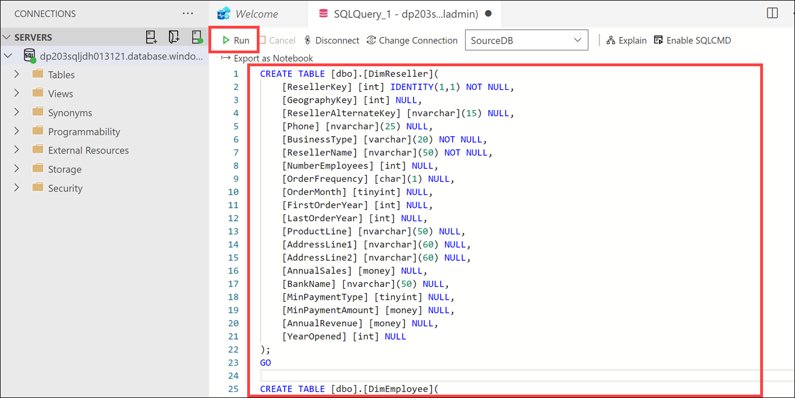

    Now we have three dimension tables and a fact table. Together, these tables represent a star schema:

    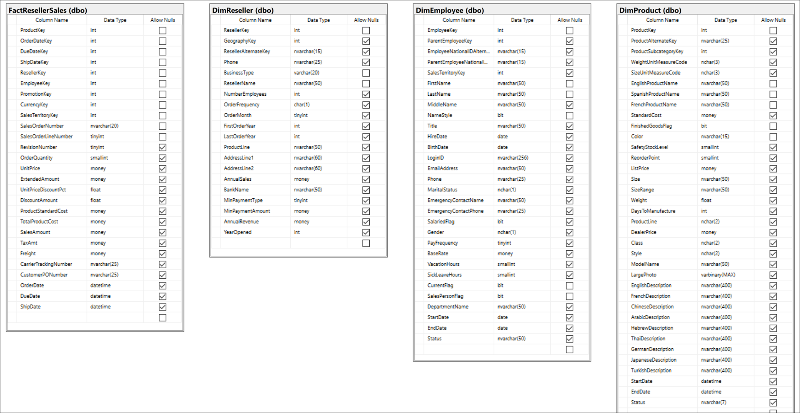

    However, since we are using a SQL database, we can add foreign key relationships and constraints to define relationships and enforce the table values.

11. Replace **and execute** the query with the following to create the `DimReseller` primary key and constraints:

    ```sql
    -- Create DimReseller PK
    ALTER TABLE [dbo].[DimReseller] WITH CHECK ADD 
        CONSTRAINT [PK_DimReseller_ResellerKey] PRIMARY KEY CLUSTERED 
        (
            [ResellerKey]
        )  ON [PRIMARY];
    GO

    -- Create DimReseller unique constraint
    ALTER TABLE [dbo].[DimReseller] ADD  CONSTRAINT [AK_DimReseller_ResellerAlternateKey] UNIQUE NONCLUSTERED 
    (
        [ResellerAlternateKey] ASC
    )WITH (PAD_INDEX = OFF, STATISTICS_NORECOMPUTE = OFF, SORT_IN_TEMPDB = OFF, IGNORE_DUP_KEY = OFF, ONLINE = OFF, ALLOW_ROW_LOCKS = ON, ALLOW_PAGE_LOCKS = ON)
    GO
    ```

12. Replace **and execute** the query with the following to create the `DimEmployee` primary key:

    ```sql
    -- Create DimEmployee PK
    ALTER TABLE [dbo].[DimEmployee] WITH CHECK ADD 
        CONSTRAINT [PK_DimEmployee_EmployeeKey] PRIMARY KEY CLUSTERED 
        (
        [EmployeeKey]
        )  ON [PRIMARY];
    GO
    ```

13. Replace **and execute** the query with the following to create the `DimProduct` primary key and constraints:

    ```sql
    -- Create DimProduct PK
    ALTER TABLE [dbo].[DimProduct] WITH CHECK ADD 
        CONSTRAINT [PK_DimProduct_ProductKey] PRIMARY KEY CLUSTERED 
        (
            [ProductKey]
        )  ON [PRIMARY];
    GO

    -- Create DimProduct unique constraint
    ALTER TABLE [dbo].[DimProduct] ADD  CONSTRAINT [AK_DimProduct_ProductAlternateKey_StartDate] UNIQUE NONCLUSTERED 
    (
        [ProductAlternateKey] ASC,
        [StartDate] ASC
    )WITH (PAD_INDEX = OFF, STATISTICS_NORECOMPUTE = OFF, SORT_IN_TEMPDB = OFF, IGNORE_DUP_KEY = OFF, ONLINE = OFF, ALLOW_ROW_LOCKS = ON, ALLOW_PAGE_LOCKS = ON)
    GO
    ```

    > Now we can create the relationships between our fact and dimension tables, clearly defining the star schema.

14. Replace **and execute** the query with the following to create the `FactResellerSales` primary key and foreign key relationships:

    ```sql
    -- Create FactResellerSales PK
    ALTER TABLE [dbo].[FactResellerSales] WITH CHECK ADD 
        CONSTRAINT [PK_FactResellerSales_SalesOrderNumber_SalesOrderLineNumber] PRIMARY KEY CLUSTERED 
        (
            [SalesOrderNumber], [SalesOrderLineNumber]
        )  ON [PRIMARY];
    GO

    -- Create foreign key relationships to the dimension tables
    ALTER TABLE [dbo].[FactResellerSales] ADD
        CONSTRAINT [FK_FactResellerSales_DimEmployee] FOREIGN KEY([EmployeeKey])
                REFERENCES [dbo].[DimEmployee] ([EmployeeKey]),
        CONSTRAINT [FK_FactResellerSales_DimProduct] FOREIGN KEY([ProductKey])
                REFERENCES [dbo].[DimProduct] ([ProductKey]),
        CONSTRAINT [FK_FactResellerSales_DimReseller] FOREIGN KEY([ResellerKey])
                REFERENCES [dbo].[DimReseller] ([ResellerKey]);
    GO
    ```

    Our star schema now has relationships defined between the fact table and dimension tables.

    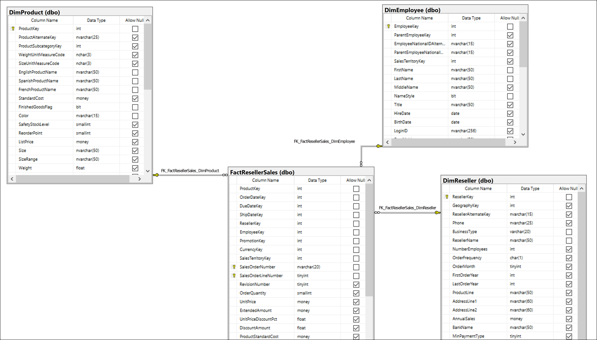

## Exercise 2: Implementing a Snowflake Schema

A **snowflake schema** is a set of normalized tables for a single business entity. For example, Adventure Works classifies products by category and subcategory. Categories are assigned to subcategories, and products are in turn assigned to subcategories. In the Adventure Works relational data warehouse, the product dimension is normalized and stored in three related tables: `DimProductCategory`, `DimProductSubcategory`, and `DimProduct`.

The snowflake schema is a variation of the star schema. You add normalized dimension tables to a star schema to create a snowflake pattern. In the following diagram, you see the yellow dimension tables surrounding the blue fact table. Notice that many of the dimension tables relate to one another in order to normalize the business entities:

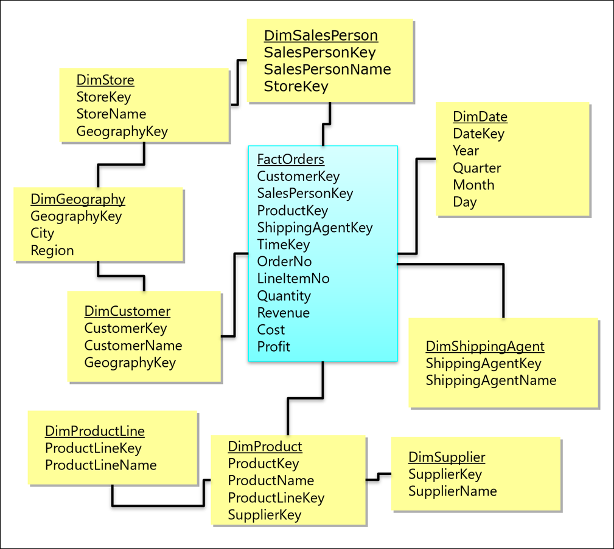

### Task 1: Create product snowflake schema in SQL database

In this task, you add two new dimension tables: `DimProductCategory` and `DimProductSubcategory`. You create a relationship between these two tables and the `DimProduct` table to create a normalized product dimension, known as a snowflake dimension. Doing so updates the star schema to include the normalized product dimension, transforming it into a snowflake schema.

1. Open Azure Data Explorer.

2. Select **Servers** in the left-hand menu, then right-click the SQL server you added at the beginning of the lab. Select **New Query**.

    

3. Paste **and execute** the following into the query window to create the new dimension tables:

    ```sql
    CREATE TABLE [dbo].[DimProductCategory](
        [ProductCategoryKey] [int] IDENTITY(1,1) NOT NULL,
        [ProductCategoryAlternateKey] [int] NULL,
        [EnglishProductCategoryName] [nvarchar](50) NOT NULL,
        [SpanishProductCategoryName] [nvarchar](50) NOT NULL,
        [FrenchProductCategoryName] [nvarchar](50) NOT NULL
    );
    GO

    CREATE TABLE [dbo].[DimProductSubcategory](
        [ProductSubcategoryKey] [int] IDENTITY(1,1) NOT NULL,
        [ProductSubcategoryAlternateKey] [int] NULL,
        [EnglishProductSubcategoryName] [nvarchar](50) NOT NULL,
        [SpanishProductSubcategoryName] [nvarchar](50) NOT NULL,
        [FrenchProductSubcategoryName] [nvarchar](50) NOT NULL,
        [ProductCategoryKey] [int] NULL
    );
    GO
    ```

4. Replace **and execute** the query with the following to create the `DimProductCategory` and `DimProductSubcategory` primary keys and constraints:

    ```sql
    -- Create DimProductCategory PK
    ALTER TABLE [dbo].[DimProductCategory] WITH CHECK ADD 
        CONSTRAINT [PK_DimProductCategory_ProductCategoryKey] PRIMARY KEY CLUSTERED 
        (
            [ProductCategoryKey]
        )  ON [PRIMARY];
    GO

    -- Create DimProductSubcategory PK
    ALTER TABLE [dbo].[DimProductSubcategory] WITH CHECK ADD 
        CONSTRAINT [PK_DimProductSubcategory_ProductSubcategoryKey] PRIMARY KEY CLUSTERED 
        (
            [ProductSubcategoryKey]
        )  ON [PRIMARY];
    GO

    -- Create DimProductCategory unique constraint
    ALTER TABLE [dbo].[DimProductCategory] ADD  CONSTRAINT [AK_DimProductCategory_ProductCategoryAlternateKey] UNIQUE NONCLUSTERED 
    (
        [ProductCategoryAlternateKey] ASC
    )WITH (PAD_INDEX = OFF, STATISTICS_NORECOMPUTE = OFF, SORT_IN_TEMPDB = OFF, IGNORE_DUP_KEY = OFF, ONLINE = OFF, ALLOW_ROW_LOCKS = ON, ALLOW_PAGE_LOCKS = ON)
    GO

    -- Create DimProductSubcategory unique constraint
    ALTER TABLE [dbo].[DimProductSubcategory] ADD  CONSTRAINT [AK_DimProductSubcategory_ProductSubcategoryAlternateKey] UNIQUE NONCLUSTERED 
    (
        [ProductSubcategoryAlternateKey] ASC
    )WITH (PAD_INDEX = OFF, STATISTICS_NORECOMPUTE = OFF, SORT_IN_TEMPDB = OFF, IGNORE_DUP_KEY = OFF, ONLINE = OFF, ALLOW_ROW_LOCKS = ON, ALLOW_PAGE_LOCKS = ON)
    GO
    ```

5. Replace **and execute** the query with the following to create foreign key relationships between `DimProduct` and `DimProductSubcategory`, and `DimProductSubcategory` and `DimProductCategory`:

    ```sql
    -- Create foreign key relationship between DimProduct and DimProductSubcategory
    ALTER TABLE [dbo].[DimProduct] ADD 
        CONSTRAINT [FK_DimProduct_DimProductSubcategory] FOREIGN KEY 
        (
            [ProductSubcategoryKey]
        ) REFERENCES [dbo].[DimProductSubcategory] ([ProductSubcategoryKey]);
    GO

    -- Create foreign key relationship between DimProductSubcategory and DimProductCategory
    ALTER TABLE [dbo].[DimProductSubcategory] ADD 
        CONSTRAINT [FK_DimProductSubcategory_DimProductCategory] FOREIGN KEY 
        (
            [ProductCategoryKey]
        ) REFERENCES [dbo].[DimProductCategory] ([ProductCategoryKey]);
    GO
    ```

    You have created a snowflake dimension by normalizing the three product tables into a single business entity, or product dimension:

    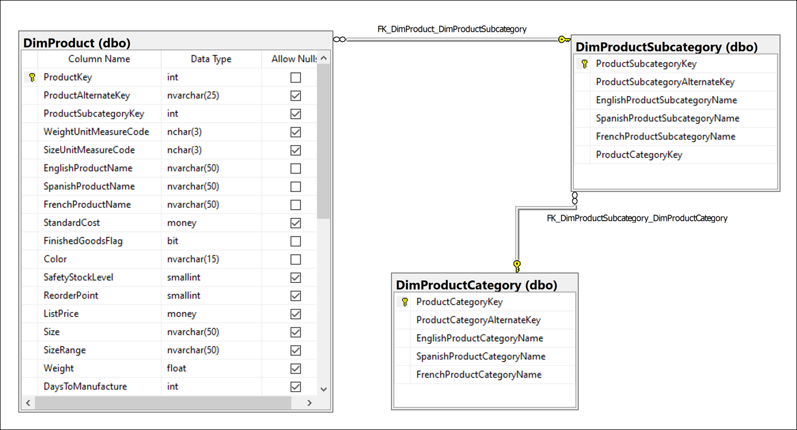

    When we add the other tables into the diagram, we can see that the star schema is now transformed into a snowflake schema by normalizing the product tables. If you arrange the tables in a diagram, using a tool such as SQL Server Management studio, you can clearly see the relationships:

    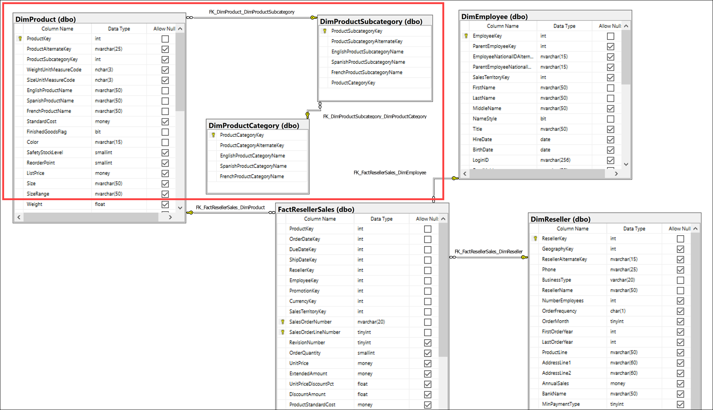

### Task 2: Create reseller snowflake schema in SQL database

In this task, you add two new dimension tables: `DimCustomer` and `DimGeography`. You create a relationship between these two tables and the `DimReseller` table to create a normalized reseller dimension, or snowflake dimension.

1. Paste **and execute** the following into the query window to create the new dimension tables:

    ```sql
    CREATE TABLE [dbo].[DimCustomer](
        [CustomerKey] [int] IDENTITY(1,1) NOT NULL,
        [GeographyKey] [int] NULL,
        [CustomerAlternateKey] [nvarchar](15) NOT NULL,
        [Title] [nvarchar](8) NULL,
        [FirstName] [nvarchar](50) NULL,
        [MiddleName] [nvarchar](50) NULL,
        [LastName] [nvarchar](50) NULL,
        [NameStyle] [bit] NULL,
        [BirthDate] [date] NULL,
        [MaritalStatus] [nchar](1) NULL,
        [Suffix] [nvarchar](10) NULL,
        [Gender] [nvarchar](1) NULL,
        [EmailAddress] [nvarchar](50) NULL,
        [YearlyIncome] [money] NULL,
        [TotalChildren] [tinyint] NULL,
        [NumberChildrenAtHome] [tinyint] NULL,
        [EnglishEducation] [nvarchar](40) NULL,
        [SpanishEducation] [nvarchar](40) NULL,
        [FrenchEducation] [nvarchar](40) NULL,
        [EnglishOccupation] [nvarchar](100) NULL,
        [SpanishOccupation] [nvarchar](100) NULL,
        [FrenchOccupation] [nvarchar](100) NULL,
        [HouseOwnerFlag] [nchar](1) NULL,
        [NumberCarsOwned] [tinyint] NULL,
        [AddressLine1] [nvarchar](120) NULL,
        [AddressLine2] [nvarchar](120) NULL,
        [Phone] [nvarchar](20) NULL,
        [DateFirstPurchase] [date] NULL,
        [CommuteDistance] [nvarchar](15) NULL
    );
    GO

    CREATE TABLE [dbo].[DimGeography](
        [GeographyKey] [int] IDENTITY(1,1) NOT NULL,
        [City] [nvarchar](30) NULL,
        [StateProvinceCode] [nvarchar](3) NULL,
        [StateProvinceName] [nvarchar](50) NULL,
        [CountryRegionCode] [nvarchar](3) NULL,
        [EnglishCountryRegionName] [nvarchar](50) NULL,
        [SpanishCountryRegionName] [nvarchar](50) NULL,
        [FrenchCountryRegionName] [nvarchar](50) NULL,
        [PostalCode] [nvarchar](15) NULL,
        [SalesTerritoryKey] [int] NULL,
        [IpAddressLocator] [nvarchar](15) NULL
    );
    GO
    ```

2. Replace **and execute** the query with the following to create the `DimCustomer` and `DimGeography` primary keys and a unique non-clustered index on the `DimCustomer` table:

    ```sql
    -- Create DimCustomer PK
    ALTER TABLE [dbo].[DimCustomer] WITH CHECK ADD 
        CONSTRAINT [PK_DimCustomer_CustomerKey] PRIMARY KEY CLUSTERED
        (
            [CustomerKey]
        )  ON [PRIMARY];
    GO

    -- Create DimGeography PK
    ALTER TABLE [dbo].[DimGeography] WITH CHECK ADD 
        CONSTRAINT [PK_DimGeography_GeographyKey] PRIMARY KEY CLUSTERED 
        (
        [GeographyKey]
        )  ON [PRIMARY];
    GO

    -- Create DimCustomer index
    CREATE UNIQUE NONCLUSTERED INDEX [IX_DimCustomer_CustomerAlternateKey] ON [dbo].[DimCustomer]([CustomerAlternateKey]) ON [PRIMARY];
    GO
    ```

3. Replace **and execute** the query with the following to create foreign key relationships between `DimReseller` and `DimGeography`, and `DimGeography` and `DimCustomer`:

    ```sql
    -- Create foreign key relationship between DimReseller and DimGeography
    ALTER TABLE [dbo].[DimReseller] ADD
        CONSTRAINT [FK_DimReseller_DimGeography] FOREIGN KEY
        (
            [GeographyKey]
        ) REFERENCES [dbo].[DimGeography] ([GeographyKey]);
    GO

    -- Create foreign key relationship between DimCustomer and DimGeography
    ALTER TABLE [dbo].[DimCustomer] ADD
        CONSTRAINT [FK_DimCustomer_DimGeography] FOREIGN KEY
        (
            [GeographyKey]
        )
        REFERENCES [dbo].[DimGeography] ([GeographyKey])
    GO
    ```

    You now have a new snowflake dimension that normalizes reseller data with geography and customer dimensions.

    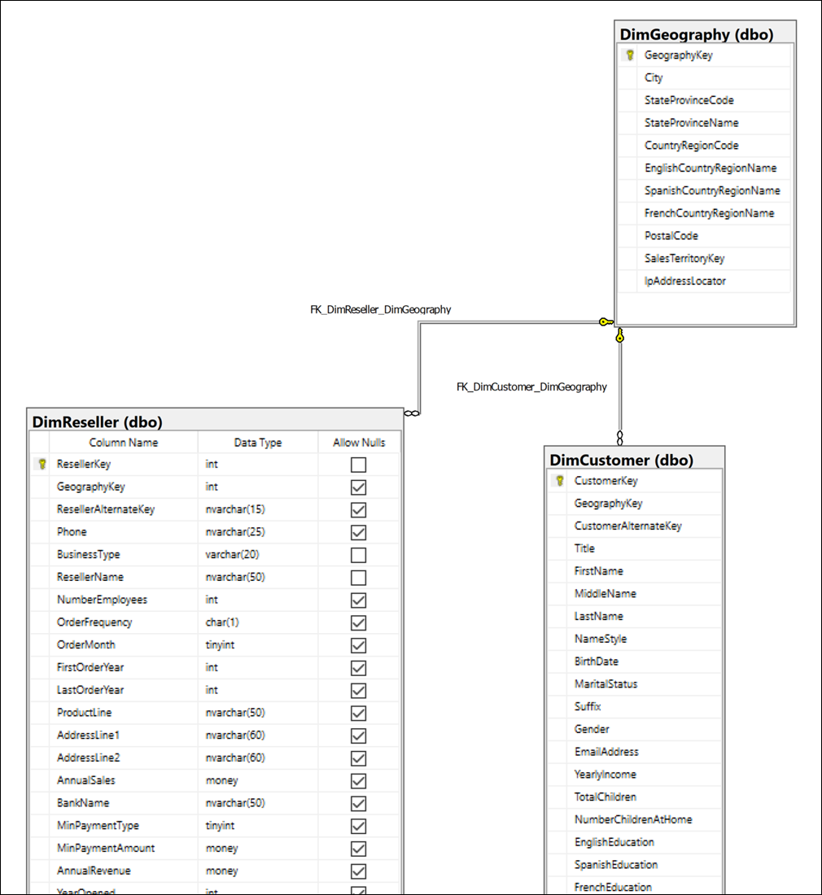

    Now let us look at how these new tables add another level of detail to our snowflake schema:

    

## Exercise 3: Implementing a Time Dimension Table

A time dimension table is one of the most consistently used dimension tables. This type of table enables consistent granularity for temporal analysis and reporting and usually contains temporal hierarchies, such as `Year` > `Quarter` > `Month` > `Day`.

Time dimension tables can contain business-specific attributes that are useful references for reporting and filters, such as fiscal periods and public holidays.

This is the schema of the time dimension table that you will create:

| Column | Data Type |
| --- | --- |
| DateKey | `int` |
| DateAltKey | `datetime` |
| CalendarYear | `int` |
| CalendarQuarter | `int` |
| MonthOfYear | `int` |
| MonthName | `nvarchar(15)` |
| DayOfMonth | `int` |
| DayOfWeek | `int` |
| DayName | `nvarchar(15)` |
| FiscalYear | `int` |
| FiscalQuarter | `int` |

### Task 1: Create time dimension table

In this task, you add the time dimension table and create foreign key relationships to the `FactRetailerSales` table.

1. Paste **and execute** the following into the query window to create the new time dimension table:

    ```sql
    CREATE TABLE DimDate
        (DateKey int NOT NULL,
        DateAltKey datetime NOT NULL,
        CalendarYear int NOT NULL,
        CalendarQuarter int NOT NULL,
        MonthOfYear int NOT NULL,
        [MonthName] nvarchar(15) NOT NULL,
        [DayOfMonth] int NOT NULL,
        [DayOfWeek] int NOT NULL,
        [DayName] nvarchar(15) NOT NULL,
        FiscalYear int NOT NULL,
        FiscalQuarter int NOT NULL)
    GO
    ```

2. Replace **and execute** the query with the following to create the primary key and a unique non-clustered index on the `DimDate` table:

    ```sql
    -- Create DimDate PK
    ALTER TABLE [dbo].[DimDate] WITH CHECK ADD 
        CONSTRAINT [PK_DimDate_DateKey] PRIMARY KEY CLUSTERED 
        (
            [DateKey]
        )  ON [PRIMARY];
    GO

    -- Create unique non-clustered index
    CREATE UNIQUE NONCLUSTERED INDEX [AK_DimDate_DateAltKey] ON [dbo].[DimDate]([DateAltKey]) ON [PRIMARY];
    GO
    ```

3. Replace **and execute** the query with the following to create foreign key relationships between `FactRetailerSales` and `DimDate`:

    ```sql
    ALTER TABLE [dbo].[FactResellerSales] ADD
        CONSTRAINT [FK_FactResellerSales_DimDate] FOREIGN KEY([OrderDateKey])
                REFERENCES [dbo].[DimDate] ([DateKey]),
        CONSTRAINT [FK_FactResellerSales_DimDate1] FOREIGN KEY([DueDateKey])
                REFERENCES [dbo].[DimDate] ([DateKey]),
        CONSTRAINT [FK_FactResellerSales_DimDate2] FOREIGN KEY([ShipDateKey])
                REFERENCES [dbo].[DimDate] ([DateKey]);
    GO
    ```

    > Notice how the three fields refer to the primary key of the `DimDate` table.

    Now our snowflake schema is updated to contain the time dimension table:

    

### Task 2: Populate the time dimension table

You can populate time dimension tables in one of many ways, including T-SQL scripts using date/time functions, Microsoft Excel functions, importing from a flat file, or auto-generation by BI (business intelligence) tools. In this task, you populate the time dimension table using T-SQL, comparing generation methods along the way.

1. Paste **and execute** the following into the query window to create the new time dimension table:

    ```sql
    DECLARE @StartDate datetime
    DECLARE @EndDate datetime
    SET @StartDate = '01/01/2005'
    SET @EndDate = getdate() 
    DECLARE @LoopDate datetime
    SET @LoopDate = @StartDate
    WHILE @LoopDate <= @EndDate
    BEGIN
    INSERT INTO dbo.DimDate VALUES
        (
            CAST(CONVERT(VARCHAR(8), @LoopDate, 112) AS int) , -- date key
            @LoopDate, -- date alt key
            Year(@LoopDate), -- calendar year
            datepart(qq, @LoopDate), -- calendar quarter
            Month(@LoopDate), -- month number of year
            datename(mm, @LoopDate), -- month name
            Day(@LoopDate),  -- day number of month
            datepart(dw, @LoopDate), -- day number of week
            datename(dw, @LoopDate), -- day name of week
            CASE
                WHEN Month(@LoopDate) < 7 THEN Year(@LoopDate)
                ELSE Year(@Loopdate) + 1
            END, -- Fiscal year (assuming fiscal year runs from Jul to June)
            CASE
                WHEN Month(@LoopDate) IN (1, 2, 3) THEN 3
                WHEN Month(@LoopDate) IN (4, 5, 6) THEN 4
                WHEN Month(@LoopDate) IN (7, 8, 9) THEN 1
                WHEN Month(@LoopDate) IN (10, 11, 12) THEN 2
            END -- fiscal quarter 
        )  		  
        SET @LoopDate = DateAdd(dd, 1, @LoopDate)
    END
    ```

    > In our environment, it took about **18 seconds** to insert the generated rows.

    This query loops from a start date of January 1, 2005 until the current date, calculating and inserting values into the table for each day.

2. Replace **and execute** the query with the following to view the time dimension table data:

    ```sql
    SELECT * FROM dbo.DimDate
    ```

    You should see an output similar to:

    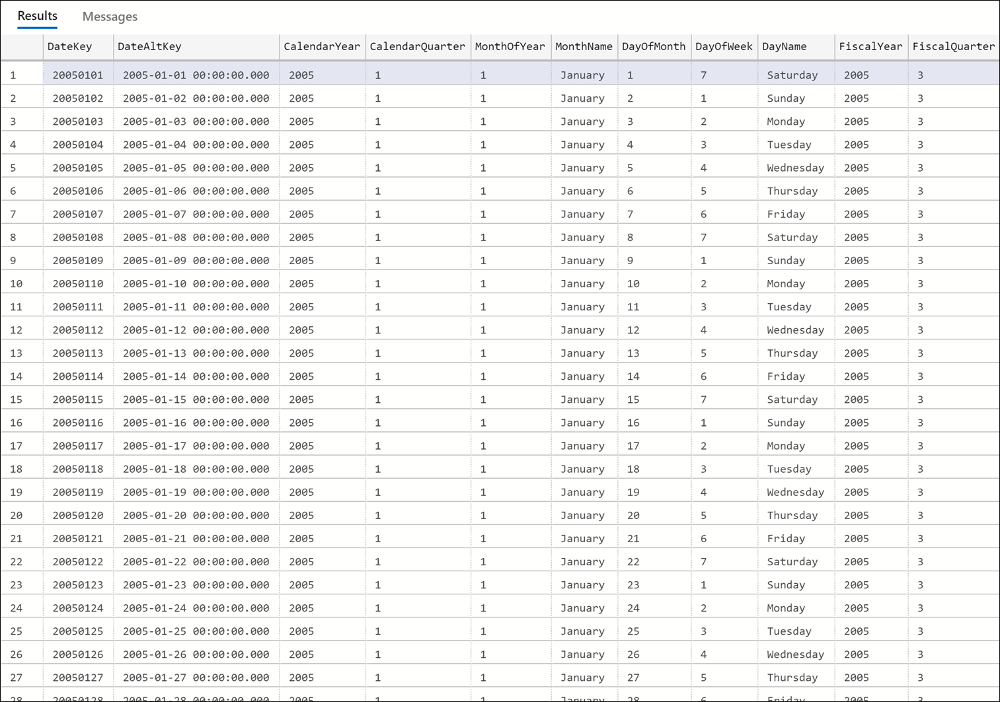

3. Here is another way you can loop through dates to populate the table, this time setting both a start and end date. Replace **and execute** the query with the following to loop through dates within a given window (January 1, 1900 - December 31, 2050) and display the output:

    ```sql
    DECLARE @BeginDate datetime
    DECLARE @EndDate datetime

    SET @BeginDate = '1/1/1900'
    SET @EndDate = '12/31/2050'

    CREATE TABLE #Dates ([date] datetime)

    WHILE @BeginDate <= @EndDate
    BEGIN
    INSERT #Dates
    VALUES
    (@BeginDate)

    SET @BeginDate = @BeginDate + 1
    END
    SELECT * FROM #Dates
    DROP TABLE #Dates
    ```

    > In our environment, it took about **4** seconds to insert the generated rows.

    This method works fine, but it has a lot to clean up, executes slowly, and has a lot of code when we factor adding in the other fields. Plus, it uses looping, which is not considered a best practice when inserting data using T-SQL.

4. Replace **and execute** the query with the following to improve the previous method with a [CTE](https://docs.microsoft.com/sql/t-sql/queries/with-common-table-expression-transact-sql?view=sql-server-ver15) (common table expression) statement:

    ```sql
    WITH mycte AS
    (
        SELECT cast('1900-01-01' as datetime) DateValue
        UNION ALL
        SELECT DateValue + 1
        FROM mycte 
        WHERE DateValue + 1 < '2050-12-31'
    )

    SELECT DateValue
    FROM mycte
    OPTION (MAXRECURSION 0)
    ```

    > In our environment, it took **less than one second** to execute the CTE query.

### Task 3: Load data into other tables

In this task, you load the dimension and fact tables with data from a public data source.

Generate the SAS Key for the stoage account got asadatalakexxxxx storage account and generate the SAS Key

 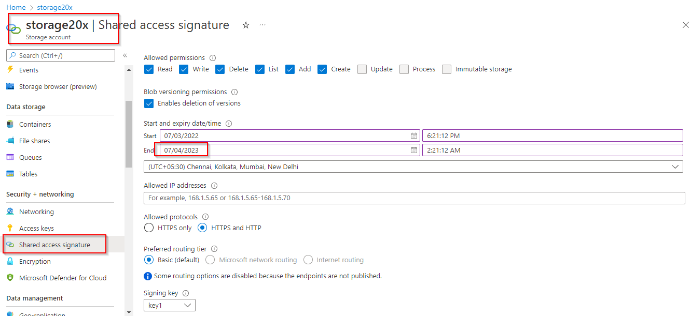

1. Paste **and execute** the following into the query window to create a master key encryption, database scoped credential, and external data source that accesses the public blob storage account that contains the source data:

    ```sql
    IF NOT EXISTS (SELECT * FROM sys.symmetric_keys) BEGIN
        declare @pasword nvarchar(400) = CAST(newid() as VARCHAR(400));
        EXEC('CREATE MASTER KEY ENCRYPTION BY PASSWORD = ''' + @pasword + '''')
    END

    CREATE DATABASE SCOPED CREDENTIAL [dataengineering]
    WITH IDENTITY='SHARED ACCESS SIGNATURE',  
    SECRET = '<SAS-Key>'
    GO

    -- Create external data source secured using credential
    CREATE EXTERNAL DATA SOURCE PublicDataSource WITH (
        TYPE = BLOB_STORAGE,
        LOCATION = 'https://<storage-account-name>.dfs.core.windows.net/data',
        CREDENTIAL = dataengineering
    );
    GO
    ```

2. Replace **and execute** the query with the following to insert data into the fact and dimension tables:

    ```sql
    BULK INSERT[dbo].[DimGeography] FROM 'awdata/DimGeography.csv'
    WITH (
        DATA_SOURCE='PublicDataSource',
        CHECK_CONSTRAINTS,
        DATAFILETYPE='widechar',
        FIELDTERMINATOR='|',
        ROWTERMINATOR='\n',
        KEEPIDENTITY,
        TABLOCK
    );
    GO

    BULK INSERT[dbo].[DimCustomer] FROM 'awdata/DimCustomer.csv'
    WITH (
        DATA_SOURCE='PublicDataSource',
        CHECK_CONSTRAINTS,
        DATAFILETYPE='widechar',
        FIELDTERMINATOR='|',
        ROWTERMINATOR='\n',
        KEEPIDENTITY,
        TABLOCK
    );
    GO

    BULK INSERT[dbo].[DimReseller] FROM 'awdata/DimReseller.csv'
    WITH (
        DATA_SOURCE='PublicDataSource',
        CHECK_CONSTRAINTS,
        DATAFILETYPE='widechar',
        FIELDTERMINATOR='|',
        ROWTERMINATOR='\n',
        KEEPIDENTITY,
        TABLOCK
    );
    GO

    BULK INSERT[dbo].[DimEmployee] FROM 'awdata/DimEmployee.csv'
    WITH (
        DATA_SOURCE='PublicDataSource',
        CHECK_CONSTRAINTS,
        DATAFILETYPE='widechar',
        FIELDTERMINATOR='|',
        ROWTERMINATOR='\n',
        KEEPIDENTITY,
        TABLOCK
    );
    GO

    BULK INSERT[dbo].[DimProductCategory] FROM 'awdata/DimProductCategory.csv'
    WITH (
        DATA_SOURCE='PublicDataSource',
        CHECK_CONSTRAINTS,
        DATAFILETYPE='widechar',
        FIELDTERMINATOR='|',
        ROWTERMINATOR='\n',
        KEEPIDENTITY,
        TABLOCK
    );
    GO

    BULK INSERT[dbo].[DimProductSubcategory] FROM 'awdata/DimProductSubcategory.csv'
    WITH (
        DATA_SOURCE='PublicDataSource',
        CHECK_CONSTRAINTS,
        DATAFILETYPE='widechar',
        FIELDTERMINATOR='|',
        ROWTERMINATOR='\n',
        KEEPIDENTITY,
        TABLOCK
    );
    GO

    BULK INSERT[dbo].[DimProduct] FROM 'awdata/DimProduct.csv'
    WITH (
        DATA_SOURCE='PublicDataSource',
        CHECK_CONSTRAINTS,
        DATAFILETYPE='widechar',
        FIELDTERMINATOR='|',
        ROWTERMINATOR='\n',
        KEEPIDENTITY,
        TABLOCK
    );
    GO

    BULK INSERT[dbo].[FactResellerSales] FROM 'awdata/FactResellerSales.csv'
    WITH (
        DATA_SOURCE='PublicDataSource',
        CHECK_CONSTRAINTS,
        DATAFILETYPE='widechar',
        FIELDTERMINATOR='|',
        ROWTERMINATOR='\n',
        KEEPIDENTITY,
        TABLOCK
    );
    GO
    ```

### Task 4: Query data

1. Paste **and execute** the following query to retrieve reseller sales data from the snowflake schema at the reseller, product, and month granularity:

    ```sql
    SELECT
            pc.[EnglishProductCategoryName]
            ,Coalesce(p.[ModelName], p.[EnglishProductName]) AS [Model]
            ,CASE
                WHEN e.[BaseRate] < 25 THEN 'Low'
                WHEN e.[BaseRate] > 40 THEN 'High'
                ELSE 'Moderate'
            END AS [EmployeeIncomeGroup]
            ,g.City AS ResellerCity
            ,g.StateProvinceName AS StateProvince
            ,r.[AnnualSales] AS ResellerAnnualSales
            ,d.[CalendarYear]
            ,d.[FiscalYear]
            ,d.[MonthOfYear] AS [Month]
            ,f.[SalesOrderNumber] AS [OrderNumber]
            ,f.SalesOrderLineNumber AS LineNumber
            ,f.OrderQuantity AS Quantity
            ,f.ExtendedAmount AS Amount  
        FROM
            [dbo].[FactResellerSales] f
        INNER JOIN [dbo].[DimReseller] r
            ON f.ResellerKey = r.ResellerKey
        INNER JOIN [dbo].[DimGeography] g
            ON r.GeographyKey = g.GeographyKey
        INNER JOIN [dbo].[DimEmployee] e
            ON f.EmployeeKey = e.EmployeeKey
        INNER JOIN [dbo].[DimDate] d
            ON f.[OrderDateKey] = d.[DateKey]
        INNER JOIN [dbo].[DimProduct] p
            ON f.[ProductKey] = p.[ProductKey]
        INNER JOIN [dbo].[DimProductSubcategory] psc
            ON p.[ProductSubcategoryKey] = psc.[ProductSubcategoryKey]
        INNER JOIN [dbo].[DimProductCategory] pc
            ON psc.[ProductCategoryKey] = pc.[ProductCategoryKey]
        ORDER BY Amount DESC
    ```

    You should see an output similar to the following:

    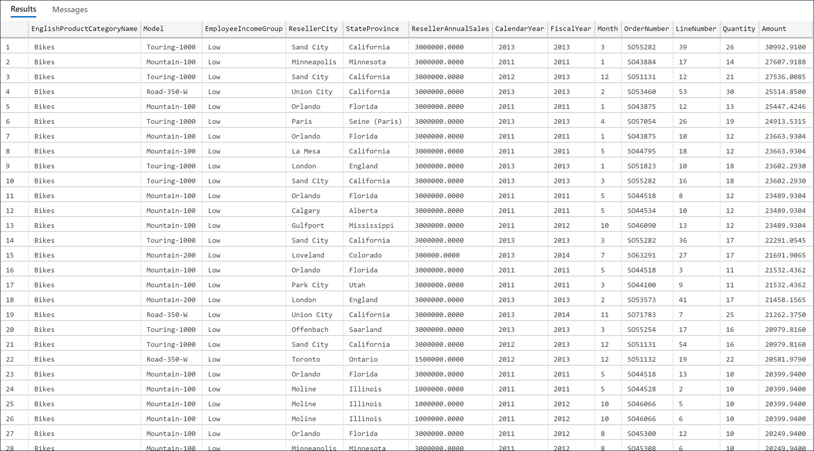

2. Replace **and execute** the query with the following to limit the results to October sales between the 2012 and 2013 fiscal years:

    ```sql
    SELECT
            pc.[EnglishProductCategoryName]
            ,Coalesce(p.[ModelName], p.[EnglishProductName]) AS [Model]
            ,CASE
                WHEN e.[BaseRate] < 25 THEN 'Low'
                WHEN e.[BaseRate] > 40 THEN 'High'
                ELSE 'Moderate'
            END AS [EmployeeIncomeGroup]
            ,g.City AS ResellerCity
            ,g.StateProvinceName AS StateProvince
            ,r.[AnnualSales] AS ResellerAnnualSales
            ,d.[CalendarYear]
            ,d.[FiscalYear]
            ,d.[MonthOfYear] AS [Month]
            ,f.[SalesOrderNumber] AS [OrderNumber]
            ,f.SalesOrderLineNumber AS LineNumber
            ,f.OrderQuantity AS Quantity
            ,f.ExtendedAmount AS Amount  
        FROM
            [dbo].[FactResellerSales] f
        INNER JOIN [dbo].[DimReseller] r
            ON f.ResellerKey = r.ResellerKey
        INNER JOIN [dbo].[DimGeography] g
            ON r.GeographyKey = g.GeographyKey
        INNER JOIN [dbo].[DimEmployee] e
            ON f.EmployeeKey = e.EmployeeKey
        INNER JOIN [dbo].[DimDate] d
            ON f.[OrderDateKey] = d.[DateKey]
        INNER JOIN [dbo].[DimProduct] p
            ON f.[ProductKey] = p.[ProductKey]
        INNER JOIN [dbo].[DimProductSubcategory] psc
            ON p.[ProductSubcategoryKey] = psc.[ProductSubcategoryKey]
        INNER JOIN [dbo].[DimProductCategory] pc
            ON psc.[ProductCategoryKey] = pc.[ProductCategoryKey]
        WHERE d.[MonthOfYear] = 10 AND d.[FiscalYear] IN (2012, 2013)
        ORDER BY d.[FiscalYear]
    ```

    You should see an output similar to the following:

    

    > Notice how using the **time dimension table** makes filtering by specific date parts and logical dates (such as fiscal year) easier and more performant than calculating date functions on the fly.


## Exercise 4: Implementing a Star Schema in Synapse

For larger data sets you may implement your data warehouse in Azure Synapse instead of SQL Server. Star schema models are still a best practice for modeling data in Synapse dedicated SQL pools. You may notice some differences with creating tables in Synapse Analytics vs. SQL database, but the same data modeling principles apply.

When you create a star schema or snowflake schema in Synapse, it requires some changes to your table creation scripts. In Synapse, you do not have foreign keys and unique value constraints like you do in SQL Server. Since these rules are not enforced at the database layer, the jobs used to load data are more responsible to maintain data integrity. You still have the option to use clustered indexes, but for most dimension tables in Synapse you will benefit from using a clustered columnstore index (CCI).

Since Synapse Analytics is a [massively parallel processing](https://docs.microsoft.com/azure/architecture/data-guide/relational-data/data-warehousing#data-warehousing-in-azure) (MPP) system, you must consider how data is distributed in your table design, as opposed to symmetric multiprocessing (SMP) systems, such as OLTP databases like Azure SQL Database. The table category often determines which option to choose for distributing the table.

| Table category | Recommended distribution option |
|:---------------|:--------------------|
| Fact           | Use hash-distribution with clustered columnstore index. Performance improves when two hash tables are joined on the same distribution column. |
| Dimension      | Use replicated for smaller tables. If tables are too large to store on each Compute node, use hash-distributed. |
| Staging        | Use round-robin for the staging table. The load with CTAS is fast. Once the data is in the staging table, use INSERT...SELECT to move the data to production tables. |

In the case of the dimension tables in this exercise, the amount of data stored per table falls well within the criteria for using a replicated distribution.

### Task 1: Create star schema in Synapse dedicated SQL

In this task, you create a star schema in Azure Synapse dedicated pool. The first step is to create the base dimension and fact tables.

1. Sign in to the Azure portal (<https://portal.azure.com>).

2. Open the resource group for this lab, then select the **Synapse workspace**.

    

3. In your Synapse workspace Overview blade, select the **Open** link within `Open Synapse Studio`.

    

4. In Synapse Studio, navigate to the **Data** hub.

    

5. Select the **Workspace** tab **(1)**, expand Databases, then right-click on **SQLPool01 (2)**. Select **New SQL script (3)**, then select **Empty script (4)**.

    

6. Paste the following script into the empty script window, then select **Run** or hit `F5` to execute the query. You may notice some changes have been made to the original SQL star schema create script. A few notable changes are:
    - Distribution setting has been added to each table
    - Clustered columnstore index is used for most tables.
    - HASH function is used for Fact table distribution since it will be a larger table that should be distributed across nodes.
    - A few fields are using varbinary data types that cannot be included in a clustered columnstore index in Azure Synapse. As a simple solution, a clustered index was used instead.
    
    ```sql
    CREATE TABLE dbo.[DimCustomer](
        [CustomerID] [int] NOT NULL,
        [Title] [nvarchar](8) NULL,
        [FirstName] [nvarchar](50) NOT NULL,
        [MiddleName] [nvarchar](50) NULL,
        [LastName] [nvarchar](50) NOT NULL,
        [Suffix] [nvarchar](10) NULL,
        [CompanyName] [nvarchar](128) NULL,
        [SalesPerson] [nvarchar](256) NULL,
        [EmailAddress] [nvarchar](50) NULL,
        [Phone] [nvarchar](25) NULL,
        [InsertedDate] [datetime] NOT NULL,
        [ModifiedDate] [datetime] NOT NULL,
        [HashKey] [char](66)
    )
    WITH
    (
        DISTRIBUTION = REPLICATE,
        CLUSTERED COLUMNSTORE INDEX
    );
    GO
    
    CREATE TABLE [dbo].[FactResellerSales](
        [ProductKey] [int] NOT NULL,
        [OrderDateKey] [int] NOT NULL,
        [DueDateKey] [int] NOT NULL,
        [ShipDateKey] [int] NOT NULL,
        [ResellerKey] [int] NOT NULL,
        [EmployeeKey] [int] NOT NULL,
        [PromotionKey] [int] NOT NULL,
        [CurrencyKey] [int] NOT NULL,
        [SalesTerritoryKey] [int] NOT NULL,
        [SalesOrderNumber] [nvarchar](20) NOT NULL,
        [SalesOrderLineNumber] [tinyint] NOT NULL,
        [RevisionNumber] [tinyint] NULL,
        [OrderQuantity] [smallint] NULL,
        [UnitPrice] [money] NULL,
        [ExtendedAmount] [money] NULL,
        [UnitPriceDiscountPct] [float] NULL,
        [DiscountAmount] [float] NULL,
        [ProductStandardCost] [money] NULL,
        [TotalProductCost] [money] NULL,
        [SalesAmount] [money] NULL,
        [TaxAmt] [money] NULL,
        [Freight] [money] NULL,
        [CarrierTrackingNumber] [nvarchar](25) NULL,
        [CustomerPONumber] [nvarchar](25) NULL,
        [OrderDate] [datetime] NULL,
        [DueDate] [datetime] NULL,
        [ShipDate] [datetime] NULL
    )
    WITH
    (
        DISTRIBUTION = HASH([SalesOrderNumber]),
        CLUSTERED COLUMNSTORE INDEX
    );
    GO

    CREATE TABLE [dbo].[DimDate]
    ( 
        [DateKey] [int]  NOT NULL,
        [DateAltKey] [datetime]  NOT NULL,
        [CalendarYear] [int]  NOT NULL,
        [CalendarQuarter] [int]  NOT NULL,
        [MonthOfYear] [int]  NOT NULL,
        [MonthName] [nvarchar](15)  NOT NULL,
        [DayOfMonth] [int]  NOT NULL,
        [DayOfWeek] [int]  NOT NULL,
        [DayName] [nvarchar](15)  NOT NULL,
        [FiscalYear] [int]  NOT NULL,
        [FiscalQuarter] [int]  NOT NULL
    )
    WITH
    (
        DISTRIBUTION = REPLICATE,
        CLUSTERED COLUMNSTORE INDEX
    );
    GO

    CREATE TABLE [dbo].[DimReseller](
        [ResellerKey] [int] NOT NULL,
        [GeographyKey] [int] NULL,
        [ResellerAlternateKey] [nvarchar](15) NULL,
        [Phone] [nvarchar](25) NULL,
        [BusinessType] [varchar](20) NOT NULL,
        [ResellerName] [nvarchar](50) NOT NULL,
        [NumberEmployees] [int] NULL,
        [OrderFrequency] [char](1) NULL,
        [OrderMonth] [tinyint] NULL,
        [FirstOrderYear] [int] NULL,
        [LastOrderYear] [int] NULL,
        [ProductLine] [nvarchar](50) NULL,
        [AddressLine1] [nvarchar](60) NULL,
        [AddressLine2] [nvarchar](60) NULL,
        [AnnualSales] [money] NULL,
        [BankName] [nvarchar](50) NULL,
        [MinPaymentType] [tinyint] NULL,
        [MinPaymentAmount] [money] NULL,
        [AnnualRevenue] [money] NULL,
        [YearOpened] [int] NULL
    )
    WITH
    (
        DISTRIBUTION = REPLICATE,
        CLUSTERED COLUMNSTORE INDEX
    );
    GO
    
    CREATE TABLE [dbo].[DimEmployee](
        [EmployeeKey] [int] NOT NULL,
        [ParentEmployeeKey] [int] NULL,
        [EmployeeNationalIDAlternateKey] [nvarchar](15) NULL,
        [ParentEmployeeNationalIDAlternateKey] [nvarchar](15) NULL,
        [SalesTerritoryKey] [int] NULL,
        [FirstName] [nvarchar](50) NOT NULL,
        [LastName] [nvarchar](50) NOT NULL,
        [MiddleName] [nvarchar](50) NULL,
        [NameStyle] [bit] NOT NULL,
        [Title] [nvarchar](50) NULL,
        [HireDate] [date] NULL,
        [BirthDate] [date] NULL,
        [LoginID] [nvarchar](256) NULL,
        [EmailAddress] [nvarchar](50) NULL,
        [Phone] [nvarchar](25) NULL,
        [MaritalStatus] [nchar](1) NULL,
        [EmergencyContactName] [nvarchar](50) NULL,
        [EmergencyContactPhone] [nvarchar](25) NULL,
        [SalariedFlag] [bit] NULL,
        [Gender] [nchar](1) NULL,
        [PayFrequency] [tinyint] NULL,
        [BaseRate] [money] NULL,
        [VacationHours] [smallint] NULL,
        [SickLeaveHours] [smallint] NULL,
        [CurrentFlag] [bit] NOT NULL,
        [SalesPersonFlag] [bit] NOT NULL,
        [DepartmentName] [nvarchar](50) NULL,
        [StartDate] [date] NULL,
        [EndDate] [date] NULL,
        [Status] [nvarchar](50) NULL,
        [EmployeePhoto] [varbinary](max) NULL
    )
    WITH
    (
        DISTRIBUTION = REPLICATE,
        CLUSTERED INDEX (EmployeeKey)
    );
    GO
    
    CREATE TABLE [dbo].[DimProduct](
        [ProductKey] [int] NOT NULL,
        [ProductAlternateKey] [nvarchar](25) NULL,
        [ProductSubcategoryKey] [int] NULL,
        [WeightUnitMeasureCode] [nchar](3) NULL,
        [SizeUnitMeasureCode] [nchar](3) NULL,
        [EnglishProductName] [nvarchar](50) NOT NULL,
        [SpanishProductName] [nvarchar](50) NULL,
        [FrenchProductName] [nvarchar](50) NULL,
        [StandardCost] [money] NULL,
        [FinishedGoodsFlag] [bit] NOT NULL,
        [Color] [nvarchar](15) NOT NULL,
        [SafetyStockLevel] [smallint] NULL,
        [ReorderPoint] [smallint] NULL,
        [ListPrice] [money] NULL,
        [Size] [nvarchar](50) NULL,
        [SizeRange] [nvarchar](50) NULL,
        [Weight] [float] NULL,
        [DaysToManufacture] [int] NULL,
        [ProductLine] [nchar](2) NULL,
        [DealerPrice] [money] NULL,
        [Class] [nchar](2) NULL,
        [Style] [nchar](2) NULL,
        [ModelName] [nvarchar](50) NULL,
        [LargePhoto] [varbinary](max) NULL,
        [EnglishDescription] [nvarchar](400) NULL,
        [FrenchDescription] [nvarchar](400) NULL,
        [ChineseDescription] [nvarchar](400) NULL,
        [ArabicDescription] [nvarchar](400) NULL,
        [HebrewDescription] [nvarchar](400) NULL,
        [ThaiDescription] [nvarchar](400) NULL,
        [GermanDescription] [nvarchar](400) NULL,
        [JapaneseDescription] [nvarchar](400) NULL,
        [TurkishDescription] [nvarchar](400) NULL,
        [StartDate] [datetime] NULL,
        [EndDate] [datetime] NULL,
        [Status] [nvarchar](7) NULL    
    )
    WITH
    (
        DISTRIBUTION = REPLICATE,
        CLUSTERED INDEX (ProductKey)
    );
    GO

    CREATE TABLE [dbo].[DimGeography](
        [GeographyKey] [int] NOT NULL,
        [City] [nvarchar](30) NULL,
        [StateProvinceCode] [nvarchar](3) NULL,
        [StateProvinceName] [nvarchar](50) NULL,
        [CountryRegionCode] [nvarchar](3) NULL,
        [EnglishCountryRegionName] [nvarchar](50) NULL,
        [SpanishCountryRegionName] [nvarchar](50) NULL,
        [FrenchCountryRegionName] [nvarchar](50) NULL,
        [PostalCode] [nvarchar](15) NULL,
        [SalesTerritoryKey] [int] NULL,
        [IpAddressLocator] [nvarchar](15) NULL
    )
    WITH
    (
        DISTRIBUTION = REPLICATE,
        CLUSTERED COLUMNSTORE INDEX
    );
    GO
    ```
    You will find `Run` in the top left corner of the script window.

### Task 2: Load data into Synapse tables

In this task, you load the Synapse dimension and fact tables with data from a public data source. There are two ways to load this data from Azure Storage files using T-SQL: the COPY command or selecting from external tables using Polybase. For this task you will use COPY since it is a simple and flexible syntax for loading delimited data from Azure Storage. If the source were a private storage account you would include a CREDENTIAL option to authorize the COPY command to read the data, but for this example that is not required.

1. Paste **and execute** the query with the following to insert data into the fact and dimension tables:

    ```sql
    COPY INTO [dbo].[DimProduct]
    FROM 'https://<storage-account-name>.dfs.core.windows.net/data/awdata/DimProduct.csv'
    WITH (
        FILE_TYPE='CSV',
        FIELDTERMINATOR='|',
        FIELDQUOTE='',
        ROWTERMINATOR='\n',
        ENCODING = 'UTF16'
    );
    GO

    COPY INTO [dbo].[DimReseller]
    FROM 'https://<storage-account-name>.dfs.core.windows.net/data/awdata/DimReseller.csv'
    WITH (
        FILE_TYPE='CSV',
        FIELDTERMINATOR='|',
        FIELDQUOTE='',
        ROWTERMINATOR='\n',
        ENCODING = 'UTF16'
    );
    GO

    COPY INTO [dbo].[DimEmployee]
    FROM 'https://<storage-account-name>.dfs.core.windows.net/data/awdata/DimEmployee.csv'
    WITH (
        FILE_TYPE='CSV',
        FIELDTERMINATOR='|',
        FIELDQUOTE='',
        ROWTERMINATOR='\n',
        ENCODING = 'UTF16'
    );
    GO

    COPY INTO [dbo].[DimGeography]
    FROM 'https://<storage-account-name>.dfs.core.windows.net/data/awdata/DimGeography.csv'
    WITH (
        FILE_TYPE='CSV',
        FIELDTERMINATOR='|',
        FIELDQUOTE='',
        ROWTERMINATOR='\n',
        ENCODING = 'UTF16'
    );
    GO

    COPY INTO [dbo].[FactResellerSales]
    FROM 'https://<storage-account-name>.dfs.core.windows.net/data/awdata/FactResellerSales.csv'
    WITH (
        FILE_TYPE='CSV',
        FIELDTERMINATOR='|',
        FIELDQUOTE='',
        ROWTERMINATOR='\n',
        ENCODING = 'UTF16'
    );
    GO
    ```

2. To populate the time dimension table in Azure Synapse, it is fastest to load the data from a delimited file since the looping method used to create the time data runs slowly. To populate this important time dimension, paste **and execute** the following in the query window:

    ```sql
    COPY INTO [dbo].[DimDate]
    FROM 'https://<storage-account-name>.dfs.core.windows.net/data/awdata/awdata/DimDate.csv'
    WITH (
        FILE_TYPE='CSV',
        FIELDTERMINATOR='|',
        FIELDQUOTE='',
        ROWTERMINATOR='0x0a',
        ENCODING = 'UTF16'
    );
    GO
    ```

### Task 3: Query data from Synapse

1. Paste **and execute** the following query to retrieve reseller sales data from the Synapse star schema at the reseller location, product, and month granularity:

    ```sql
    SELECT
        Coalesce(p.[ModelName], p.[EnglishProductName]) AS [Model]
        ,g.City AS ResellerCity
        ,g.StateProvinceName AS StateProvince
        ,d.[CalendarYear]
        ,d.[FiscalYear]
        ,d.[MonthOfYear] AS [Month]
        ,sum(f.OrderQuantity) AS Quantity
        ,sum(f.ExtendedAmount) AS Amount
        ,approx_count_distinct(f.SalesOrderNumber) AS UniqueOrders  
    FROM
        [dbo].[FactResellerSales] f
    INNER JOIN [dbo].[DimReseller] r
        ON f.ResellerKey = r.ResellerKey
    INNER JOIN [dbo].[DimGeography] g
        ON r.GeographyKey = g.GeographyKey
    INNER JOIN [dbo].[DimDate] d
        ON f.[OrderDateKey] = d.[DateKey]
    INNER JOIN [dbo].[DimProduct] p
        ON f.[ProductKey] = p.[ProductKey]
    GROUP BY
        Coalesce(p.[ModelName], p.[EnglishProductName])
        ,g.City
        ,g.StateProvinceName
        ,d.[CalendarYear]
        ,d.[FiscalYear]
        ,d.[MonthOfYear]
    ORDER BY Amount DESC
    ```

    You should see an output similar to the following:

    

2. Replace **and execute** the query with the following to limit the results to October sales between the 2012 and 2013 fiscal years:

    ```sql
    SELECT
        Coalesce(p.[ModelName], p.[EnglishProductName]) AS [Model]
        ,g.City AS ResellerCity
        ,g.StateProvinceName AS StateProvince
        ,d.[CalendarYear]
        ,d.[FiscalYear]
        ,d.[MonthOfYear] AS [Month]
        ,sum(f.OrderQuantity) AS Quantity
        ,sum(f.ExtendedAmount) AS Amount
        ,approx_count_distinct(f.SalesOrderNumber) AS UniqueOrders  
    FROM
        [dbo].[FactResellerSales] f
    INNER JOIN [dbo].[DimReseller] r
        ON f.ResellerKey = r.ResellerKey
    INNER JOIN [dbo].[DimGeography] g
        ON r.GeographyKey = g.GeographyKey
    INNER JOIN [dbo].[DimDate] d
        ON f.[OrderDateKey] = d.[DateKey]
    INNER JOIN [dbo].[DimProduct] p
        ON f.[ProductKey] = p.[ProductKey]
    WHERE d.[MonthOfYear] = 10 AND d.[FiscalYear] IN (2012, 2013)
    GROUP BY
        Coalesce(p.[ModelName], p.[EnglishProductName])
        ,g.City
        ,g.StateProvinceName
        ,d.[CalendarYear]
        ,d.[FiscalYear]
        ,d.[MonthOfYear]
    ORDER BY d.[FiscalYear]
    ```

    You should see an output similar to the following:

    

    > Notice how using the **time dimension table** makes filtering by specific date parts and logical dates (such as fiscal year) easier and more performant than calculating date functions on the fly.
